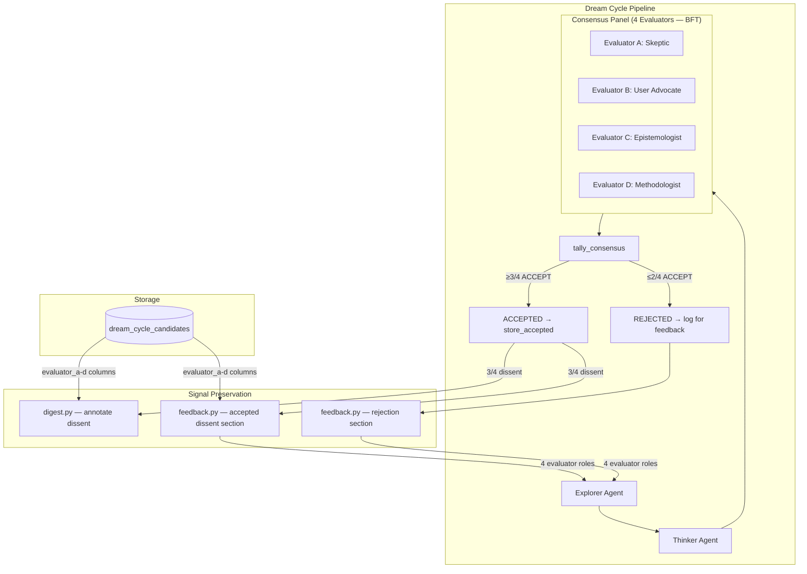
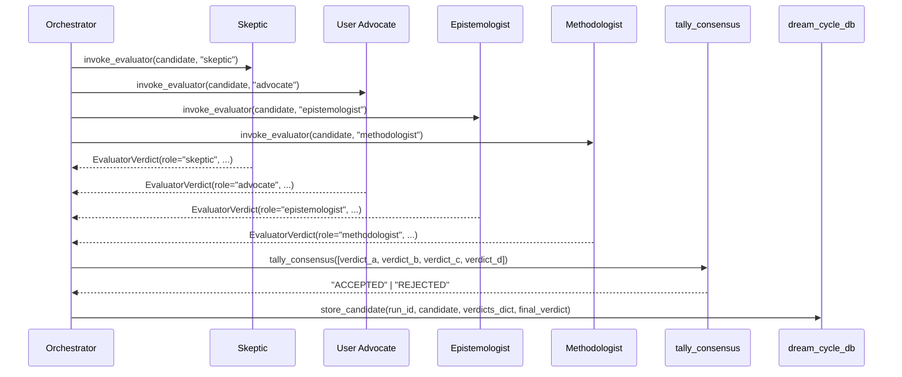

# Design Document: Byzantine Consensus Panel

## Overview

This feature upgrades the Dream Cycle's consensus panel from 3 evaluators to 4, adding a Methodologist evaluator and replacing the three-state consensus model (ACCEPTED/DEFERRED/REJECTED) with a binary BFT-correct model. The theoretical foundation is Lamport, Shostak, and Pease (1982), "The Byzantine Generals Problem" (ACM TOPLAS), which proved that tolerating f faulty nodes requires 3f+1 total nodes. With f=1 (one potentially hallucinating evaluator), the panel needs 4 evaluators. The PBFT quorum (Castro & Liskov 1999) of 2f+1 = 3 out of 4 is the acceptance threshold.

The consensus model:
- **≥3/4 ACCEPT → ACCEPTED** (BFT quorum met — at least 2 loyal evaluators agreed)
- **≤2/4 ACCEPT → REJECTED** (insufficient consensus under worst-case BFT assumption)
- **No DEFERRED state** — binary consensus only

The fourth evaluator — the Methodologist — assesses internal consistency, source independence, reasoning structure, and reproducibility. This perspective is orthogonal to the existing three (factual grounding, user value, epistemic quality), completing the coverage model.

### BFT Rationale: Why Binary Consensus

In the PBFT model, a quorum of 2f+1 out of 3f+1 nodes guarantees safety because any two quorums overlap in at least f+1 nodes, ensuring at least one honest node in the intersection. With f=1, the BFT quorum is 3 out of 4.

**Why 3/4 = ACCEPTED (not DEFERRED):** The BFT quorum is the mathematically proven safe threshold. Requiring 4/4 for acceptance would mean tolerating 0 faults — the same as the old 3/3 model with an extra evaluator call. That undermines the reason for adding the fourth evaluator.

**Why 2/4 = REJECTED (not DEFERRED):** With 4 nodes and f=1, a 2/4 split is ambiguous:
- If the hallucinator is one of the 2 accepts → only 1 loyal evaluator supports the insight
- If the hallucinator is one of the 2 rejects → 2 loyal evaluators support it (genuine split)
- You cannot distinguish these cases (that's the whole point of Byzantine faults)
- Worst-case design → REJECTED

**Why DEFERRED is removed:** The old DEFERRED (2/3 in the 3-evaluator model) meant "one dissenter — give it another shot." With 4 evaluators, the equivalent "one dissenter" case is 3/4, which now meets the BFT quorum and is ACCEPTED directly. The 2/4 case is not a "narrow miss" — it's an ambiguous result. The Reflexion pattern (Shinn 2023) that DEFERRED enabled requires a trustworthy trigger signal, and 2/4 is not trustworthy.

**Signal preservation without re-evaluation:** Dissenting reasoning on accepted insights (3/4 cases) is preserved through two lightweight mechanisms:
1. Digest annotation: "Accepted (3/4) — [Role] dissented: [reasoning]"
2. Feedback injection: "Dissenting concerns on accepted insights" section surfaces patterns from non-unanimous accepts

This provides the same learning loop as DEFERRED without the re-evaluation machinery, and addresses systemic issues (patterns across candidates) rather than individual cases.

## Architecture

### High-Level Component Diagram



### Data Flow for a Single Candidate



## Components and Interfaces

### 1. `src/dream_cycle/consensus.py` — tally_consensus()

**Current:** Accepts 3 verdicts, maps 3/3→ACCEPTED, 2/3→DEFERRED, else→REJECTED.

**New:** Accepts exactly 4 verdicts, binary output: ≥3 ACCEPT → ACCEPTED, else → REJECTED.

```python
def tally_consensus(verdicts: list[EvaluatorVerdict]) -> str:
    """Tally binary BFT consensus from 4 evaluator verdicts.

    Implements Lamport's 3f+1 bound with f=1: the BFT quorum is
    2f+1 = 3 out of 4 evaluators. Binary output — no DEFERRED state.

    Args:
        verdicts: List of exactly 4 EvaluatorVerdict objects.

    Returns:
        "ACCEPTED" if ≥3/4 ACCEPT, "REJECTED" otherwise.

    Raises:
        ValueError: If len(verdicts) != 4.
    """
    if len(verdicts) != 4:
        raise ValueError(f"Expected 4 verdicts, got {len(verdicts)}")
    accept_count = sum(1 for v in verdicts if v.verdict == "ACCEPT")
    return "ACCEPTED" if accept_count >= 3 else "REJECTED"
```

### 2. `src/dream_cycle/orchestrator.py` — DreamCycleOrchestrator

**Changes to `_run_pipeline` (Step 7) — binary consensus, no DEFERRED:**

```python
# Step 7: Consensus Panel — invoke 4 evaluators per candidate
for candidate in all_candidates:
    verdict_a = self._invoke_evaluator_safe(candidate, "skeptic")
    verdict_b = self._invoke_evaluator_safe(candidate, "advocate")
    verdict_c = self._invoke_evaluator_safe(candidate, "epistemologist")
    verdict_d = self._invoke_evaluator_safe(candidate, "methodologist")

    evaluator_verdicts = [verdict_a, verdict_b, verdict_c, verdict_d]
    final = tally_consensus(evaluator_verdicts)

    verdicts_dict = {
        "evaluator_a_verdict": verdict_a.verdict,
        "evaluator_a_reasoning": verdict_a.reasoning,
        "evaluator_b_verdict": verdict_b.verdict,
        "evaluator_b_reasoning": verdict_b.reasoning,
        "evaluator_c_verdict": verdict_c.verdict,
        "evaluator_c_reasoning": verdict_c.reasoning,
        "evaluator_d_verdict": verdict_d.verdict,
        "evaluator_d_reasoning": verdict_d.reasoning,
    }

    candidate_dict = asdict(candidate)

    if final == "ACCEPTED":
        existing = check_duplicate(candidate.content, threshold=0.85)
        memory_id = None
        if existing is None:
            memory_id = store_accepted(candidate)
        dream_cycle_db.store_candidate(
            run_id, candidate_dict, verdicts_dict, "ACCEPTED", memory_id
        )
        accepted.append(candidate)
    else:  # REJECTED — no DEFERRED branch
        dream_cycle_db.store_candidate(
            run_id, candidate_dict, verdicts_dict, "REJECTED"
        )
        rejected.append(candidate)
```

**Removals:**
- `_is_second_deferral()` method — deleted
- Deferred candidate retrieval (`get_deferred_candidates`, `get_previous_run_id`) — removed from pipeline
- Deferred candidate handling in `invoke_thinker()` — the `deferred` parameter and payload section removed
- `deferred_new` list — removed; `candidates_deferred` always 0 in DreamCycleResult

### 3. `src/prompts.py` — Methodologist Prompt Template

**New Methodologist criteria constant and role entries** (same as previous design version — unchanged by DEFERRED removal).

```python
_METHODOLOGIST_CRITERIA = """\
## Evaluate on these criteria:

1. INTERNAL CONSISTENCY — Do the insight's claims, evidence citations, and \
conclusions form a logically coherent argument? Are there self-contradictions \
between what the EVIDENCE section says and what the WHAT section claims?

2. SOURCE INDEPENDENCE — Do the cited source memories represent genuinely \
independent data points? Or are they derivatives of the same original source \
(e.g., a memory and its chunk, or two memories from the same conversation)?

3. REASONING STRUCTURE — Does the insight follow the depth framework \
(WHAT, EVIDENCE, WHY IT MATTERS) with each section substantively contributing? \
Or does WHY IT MATTERS merely restate WHAT in different words?

4. REPRODUCIBILITY — Would another agent examining the same source memories \
plausibly arrive at the same or a compatible conclusion? Or does the insight \
depend on unstated assumptions or creative leaps not grounded in the sources?

For UPDATE/SUPERSEDE operations, apply additional scrutiny:
5. TRACEABLE REASONING — Does the proposed change follow from the cited \
evidence through a traceable chain of reasoning? Or does it introduce \
conclusions that require unstated assumptions not present in the sources?"""
```

Updated `_ROLE_DESCRIPTIONS` and `_ROLE_CRITERIA` dicts add `"methodologist"` entries. `get_evaluator_prompt` error message lists all four valid roles.

### 4. `src/dream_cycle/feedback.py` — build_feedback_injection()

**Two changes:**

1. Add `"evaluator_d": "Methodologist"` to the `evaluator_roles` dict (for rejected candidates)
2. Add new "Dissenting concerns on accepted insights" section (for non-unanimous accepts)

```python
def build_feedback_injection() -> str:
    rejections = dream_cycle_db.get_recent_rejections(n_cycles=3)
    accepted_dissents = dream_cycle_db.get_accepted_dissents(n_cycles=3)  # NEW query
    user_rejections = dream_cycle_db.get_user_rejections(n_cycles=3)

    evaluator_roles = {
        "evaluator_a": "Skeptic",
        "evaluator_b": "User Advocate",
        "evaluator_c": "Epistemologist",
        "evaluator_d": "Methodologist",  # NEW
    }

    # Part 1: Evaluator rejections (existing, updated with 4 roles)
    # ... same grouping logic, now iterates 4 evaluator roles ...

    # Part 2: Dissenting concerns on accepted insights (NEW)
    if accepted_dissents:
        dissent_lines = ["## Dissenting concerns on accepted insights"]
        for row in accepted_dissents:
            for key_prefix, role_name in evaluator_roles.items():
                verdict = row.get(f"{key_prefix}_verdict", "")
                reasoning = row.get(f"{key_prefix}_reasoning", "")
                if verdict == "REJECT" and reasoning:
                    title = (row.get("candidate_json") or {}).get("title", "Unknown")
                    dissent_lines.append(
                        f'- {role_name} dissented on accepted "{title}": "{reasoning}"'
                    )
        parts.append("\n".join(dissent_lines))

    # Part 3: User rejections (existing, unchanged)
```

### 5. `src/dream_cycle/digest.py` — generate_digest()

**Two changes:**

1. Add `"methodologist"` to the evaluator role loop
2. Annotate non-unanimous accepts with dissent info

```python
# Evaluator reasoning for accepted insights
for role in ("skeptic", "advocate", "epistemologist", "methodologist"):  # +methodologist
    rv = v.get(role, {})
    verdict = rv.get("verdict", "N/A")
    reasoning = rv.get("reasoning", "")
    lines.append(f"- **{role.capitalize()}** ({verdict}): {reasoning}")

# Acceptance annotation
accept_count = sum(
    1 for role in ("skeptic", "advocate", "epistemologist", "methodologist")
    if v.get(role, {}).get("verdict") == "ACCEPT"
)
if accept_count == 4:
    lines.append(f"**Accepted (4/4 — unanimous)**")
elif accept_count == 3:
    dissenter = next(
        role for role in ("skeptic", "advocate", "epistemologist", "methodologist")
        if v.get(role, {}).get("verdict") != "ACCEPT"
    )
    dissent_reasoning = v.get(dissenter, {}).get("reasoning", "")
    lines.append(f"**Accepted (3/4) — {dissenter.capitalize()} dissented: {dissent_reasoning}**")
```

### 6. `src/dream_cycle_db.py` — Database Functions

#### `store_candidate()` — add evaluator_d columns

INSERT statement grows from 13 to 15 columns (adds evaluator_d_verdict, evaluator_d_reasoning).

#### `get_recent_rejections()` — add evaluator_d columns

SELECT adds evaluator_d_verdict and evaluator_d_reasoning.

#### `get_accepted_dissents()` — NEW function

```python
def get_accepted_dissents(n_cycles: int = 3) -> list[dict]:
    """Query accepted candidates with at least one REJECT verdict from recent cycles.

    Returns rows where final_verdict = 'ACCEPTED' and at least one of
    evaluator_a/b/c/d_verdict = 'REJECT'. Used for feedback injection
    to surface dissenting concerns on accepted insights.
    """
    # SELECT from dream_cycle_candidates
    # JOIN dream_cycle_runs for cycle ordering
    # WHERE final_verdict = 'ACCEPTED'
    #   AND (evaluator_a_verdict = 'REJECT' OR evaluator_b_verdict = 'REJECT'
    #        OR evaluator_c_verdict = 'REJECT' OR evaluator_d_verdict = 'REJECT')
    # ORDER BY completed_at DESC
    # LIMIT based on n_cycles
```

#### `get_evaluator_verdicts_for_run()` — add methodologist key

Return dict includes `"methodologist"` key alongside existing three.

#### `get_tier1_metrics()` — factor of 4

```python
evaluator_calls = 4 * gen  # was: 3 * gen
```

#### Deprecated functions (no longer called):
- `get_deferred_candidates()` — retained for backward compatibility but no longer called by orchestrator
- `mark_deferred_twice_rejected()` — retained but no longer called

### 7. `src/models.py` — EvaluatorVerdict

No structural change. Docstring updated to list all four valid roles: skeptic, advocate, epistemologist, methodologist.

### 8. Database Migration — `migrations/004_evaluator_d.sql`

```sql
-- Migration 004: Add fourth evaluator (Methodologist) columns
-- Supports Byzantine fault tolerance with 4-evaluator binary consensus panel.
-- Lamport 3f+1 bound: 4 evaluators tolerate 1 faulty (hallucinating) evaluator.

ALTER TABLE dream_cycle_candidates
    ADD COLUMN IF NOT EXISTS evaluator_d_verdict TEXT,
    ADD COLUMN IF NOT EXISTS evaluator_d_reasoning TEXT;

COMMENT ON COLUMN dream_cycle_candidates.evaluator_d_verdict IS
    'Methodologist evaluator verdict (ACCEPT/REJECT). Fourth evaluator for BFT.';
COMMENT ON COLUMN dream_cycle_candidates.evaluator_d_reasoning IS
    'Methodologist evaluator reasoning text.';
```

### 9. `docs/DREAM-CYCLE-DESIGN.md` — Documentation Update

Update the following sections:
- "Architectural Decision: Unanimous Consensus (3/3) Is Permanent" → retitle to reflect binary BFT consensus, document the design discussion that led to removing DEFERRED
- "Architecture: Four-Agent Byzantine Consensus Pipeline" → update diagram to show 4 evaluators, binary output
- Consensus Protocol section → update mapping, remove DEFERRED branch
- Add Methodologist to evaluator descriptions
- Add references: Lamport 1982, Castro & Liskov 1999 (PBFT)
- Document the accepted dissent mechanism as the replacement for DEFERRED's Reflexion loop

## Data Models

### Database Schema Change

```sql
-- dream_cycle_candidates table (existing columns unchanged)
-- New columns added by migration 004:
evaluator_d_verdict TEXT,      -- "ACCEPT" or "REJECT"
evaluator_d_reasoning TEXT     -- Non-empty reasoning string
```

### Verdicts Dictionary (in-memory)

```python
verdicts_dict = {
    "evaluator_a_verdict": str,     # "ACCEPT" | "REJECT"
    "evaluator_a_reasoning": str,
    "evaluator_b_verdict": str,
    "evaluator_b_reasoning": str,
    "evaluator_c_verdict": str,
    "evaluator_c_reasoning": str,
    "evaluator_d_verdict": str,     # NEW
    "evaluator_d_reasoning": str,   # NEW
}
```

### Consensus Truth Table (all 16 combinations — binary model)

| A | B | C | D | Accept Count | Result |
|---|---|---|---|---|---|
| A | A | A | A | 4 | ACCEPTED |
| A | A | A | R | 3 | ACCEPTED |
| A | A | R | A | 3 | ACCEPTED |
| A | R | A | A | 3 | ACCEPTED |
| R | A | A | A | 3 | ACCEPTED |
| A | A | R | R | 2 | REJECTED |
| A | R | A | R | 2 | REJECTED |
| A | R | R | A | 2 | REJECTED |
| R | A | A | R | 2 | REJECTED |
| R | A | R | A | 2 | REJECTED |
| R | R | A | A | 2 | REJECTED |
| A | R | R | R | 1 | REJECTED |
| R | A | R | R | 1 | REJECTED |
| R | R | A | R | 1 | REJECTED |
| R | R | R | A | 1 | REJECTED |
| R | R | R | R | 0 | REJECTED |

## Correctness Properties

### Property 1: Binary BFT Consensus Tally Correctness

*For any* list of 4 binary verdicts (each ACCEPT or REJECT), `tally_consensus` returns exactly one of ACCEPTED or REJECTED with the correct mapping: accept_count ≥ 3 → ACCEPTED, accept_count ≤ 2 → REJECTED. The function never returns DEFERRED.

**Validates: Requirements 2.1, 2.2, 2.3**

### Property 2: Tally Input Validation

*For any* list of verdicts with length ≠ 4, `tally_consensus` raises ValueError.

**Validates: Requirements 2.4, 2.5**

### Property 3: Methodologist Prompt Completeness

*For any* candidate JSON string and source memories content string, calling `get_evaluator_prompt(role="methodologist", candidate_json, source_memories_content)` returns a prompt string that contains all four Methodologist criteria keywords: "internal consistency", "source independence", "reasoning structure", and "reproducibility".

**Validates: Requirements 1.1, 1.2, 1.3, 1.4, 4.1, 4.2**

### Property 4: Four-Evaluator Orchestration

*For any* candidate insight, the orchestrator invokes exactly 4 evaluators (skeptic, advocate, epistemologist, methodologist) and produces a verdicts dictionary containing all 8 keys (evaluator_a through evaluator_d, verdict and reasoning).

**Validates: Requirements 3.1, 3.3**

### Property 5: Evaluator Independence

*For any* candidate evaluation across all 4 evaluator roles, no evaluator's prompt contains another evaluator's verdict or reasoning.

**Validates: Requirements 3.4**

### Property 6: No DEFERRED in Pipeline

*For any* execution of the consensus pipeline, the final verdict for every candidate is either ACCEPTED or REJECTED, never DEFERRED. The `candidates_deferred` count in DreamCycleResult is always 0.

**Validates: Requirements 2.3, 6.1, 6.5**

### Property 7: Feedback Injection Includes Methodologist and Accepted Dissents

*For any* set of rejection records where evaluator_d_verdict is "REJECT", `build_feedback_injection()` includes the Methodologist's rejection reasoning. Additionally, *for any* accepted candidate with at least one REJECT verdict, the feedback injection includes a "Dissenting concerns on accepted insights" section.

**Validates: Requirements 8.1, 8.2, 8.3**

### Property 8: Digest Annotates Non-Unanimous Accepts

*For any* accepted candidate with 3/4 verdicts (one dissenter), `generate_digest()` includes "Accepted (3/4)" with the dissenter's role and reasoning. *For any* accepted candidate with 4/4 verdicts, the digest includes "Accepted (4/4 — unanimous)".

**Validates: Requirements 7.1, 7.2, 7.3**

### Property 9: store_candidate Persists Evaluator D

*For any* verdicts dictionary containing evaluator_d_verdict and evaluator_d_reasoning, `store_candidate()` persists both values to the dream_cycle_candidates table.

**Validates: Requirements 5.2**

## Error Handling

### Methodologist Crash/Timeout

The Methodologist uses the same `_invoke_evaluator_safe` wrapper as the existing three evaluators. On `TimeoutError`, `RuntimeError`, or unparseable output, the wrapper retries up to `EVALUATOR_MAX_ATTEMPTS`; if the evaluator still fails, it raises and the run aborts loudly (`aborted_early=True`, exit 2, notification) — it never fabricates a verdict.

A crash is an *omission* fault (no vote), not a *commission* fault (an arbitrary/hallucinated vote). The BFT quorum (≥3/4, f=1) is designed to tolerate one *commission* fault — not to absorb a crash. Fabricating a REJECT would convert an omission into a commission and spend the f=1 budget on a non-Byzantine event: a crash plus one genuine bad vote would then be two effective faults against an f=1 panel, and the quorum could be wrong. So crashes are handled upstream by retry/abort, reserving the quorum's full tolerance for genuine bad votes.

### Migration Safety

The migration uses `ADD COLUMN IF NOT EXISTS` to be idempotent. New columns default to NULL, so existing rows are unaffected. The `store_candidate` function handles absent `evaluator_d_verdict` and `evaluator_d_reasoning` in the verdicts dict by defaulting to NULL.

### Input Validation

`tally_consensus` validates that exactly 4 verdicts are provided, raising `ValueError` otherwise. This catches integration bugs where the orchestrator might pass the wrong number of verdicts.

### Invalid Evaluator Role

`get_evaluator_prompt` raises `ValueError` for any role not in the 4-role set, with an error message listing all valid roles.

## Testing Strategy

### Property-Based Testing

Use Hypothesis with `@settings(max_examples=100)` for each property test.

1. **Property 1 — Binary Consensus Tally**: Generate all 16 combinations of 4 binary verdicts. Assert: count ≥ 3 → ACCEPTED, count ≤ 2 → REJECTED. Assert DEFERRED never returned.

2. **Property 2 — Input Validation**: Generate lists of length 0-3 and 5+. Assert ValueError raised.

3. **Property 3 — Methodologist Prompt**: Generate random candidate JSON and source content. Assert prompt contains all 4 criteria keywords.

4. **Property 4 — Four-Evaluator Orchestration**: Mock invoker. Assert exactly 4 invocations and 8-key verdicts dict.

5. **Property 5 — Evaluator Independence**: Capture all 4 prompts. Assert no cross-contamination.

6. **Property 6 — No DEFERRED**: Run full pipeline with mocked evaluators returning various verdict combinations. Assert no candidate has final_verdict = "DEFERRED".

7. **Property 7 — Feedback with Methodologist + Accepted Dissents**: Mock DB queries. Assert "Methodologist" appears in output for evaluator_d rejections. Assert "Dissenting concerns" section appears for non-unanimous accepts.

8. **Property 8 — Digest Dissent Annotation**: Mock verdicts. Assert "Accepted (3/4)" with dissenter info for non-unanimous. Assert "Accepted (4/4 — unanimous)" for unanimous.

9. **Property 9 — store_candidate Evaluator D**: Mock DB cursor. Assert INSERT includes evaluator_d columns.

### Unit Tests

- All 16 truth table combinations (explicit)
- `tally_consensus` with wrong-length input → ValueError
- `get_evaluator_prompt("methodologist", ...)` returns prompt with role description
- `get_evaluator_prompt("invalid_role", ...)` raises ValueError listing 4 roles
- Methodologist crash/timeout → retried, then (if persistent) raises → run aborts (`aborted_early`); never a fabricated REJECT
- `store_candidate` with missing evaluator_d keys → NULL values
- Cost efficiency metric uses factor of 4
- Migration SQL contains evaluator_d columns
- DreamCycleResult.candidates_deferred is always 0
- Orchestrator does not call get_deferred_candidates or _is_second_deferral

### Integration Test Updates

- `tests/test_consensus.py`: Update from 3-verdict to 4-verdict, remove DEFERRED assertions
- `tests/test_dream_cycle.py`: Add 4th evaluator invocation, remove deferred handling assertions
- `tests/test_integration.py`: Update threshold assertions (e.g., epistemologist REJECT + 3 ACCEPT = ACCEPTED, not DEFERRED)
