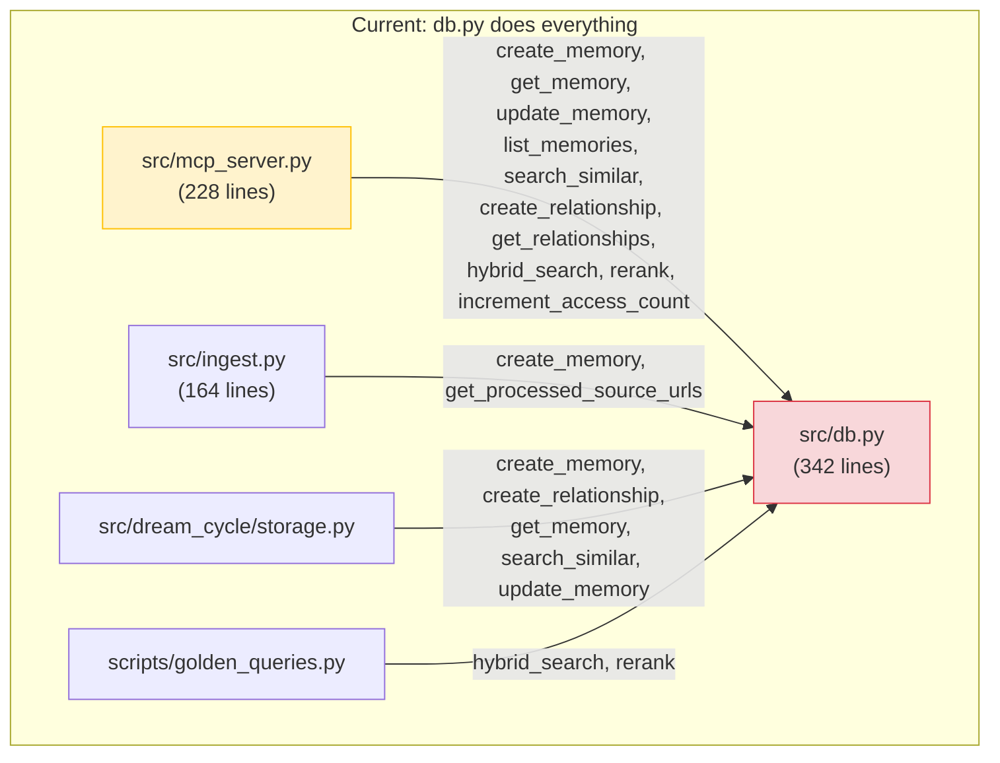
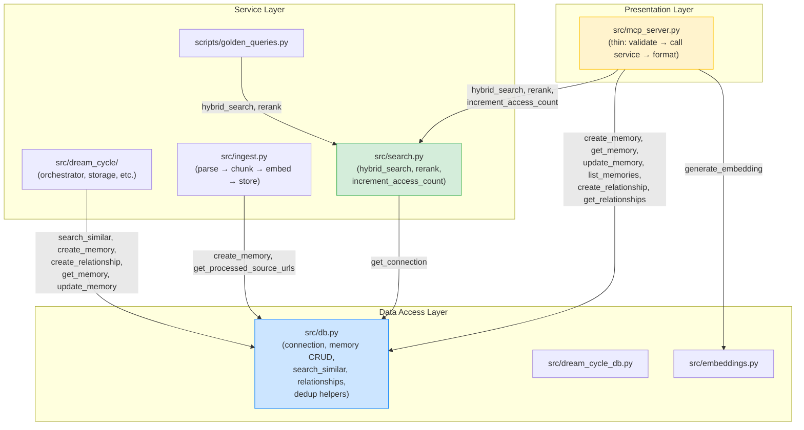
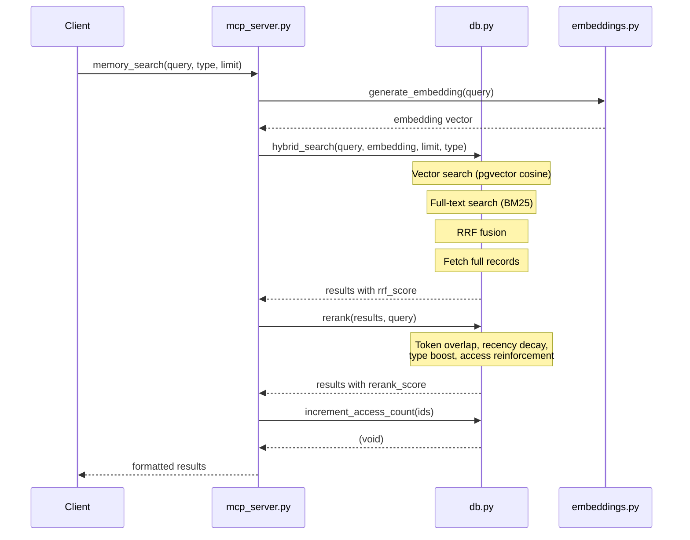
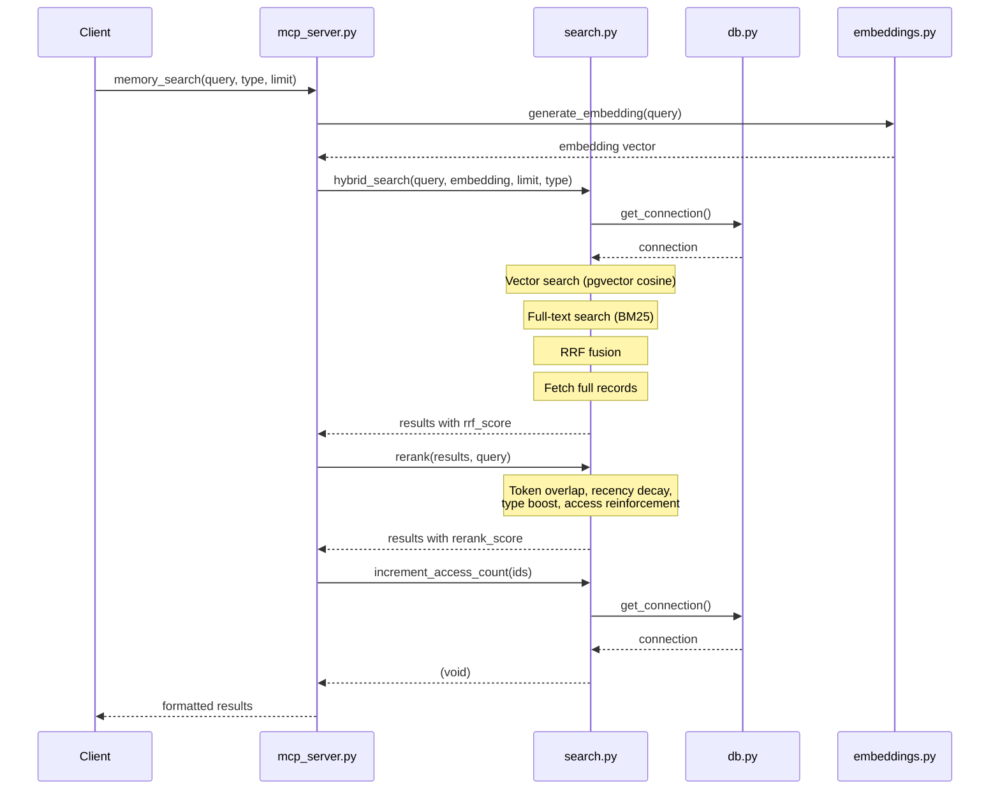

# Design Document: Data Layer Decomposition

## Overview

This design describes the structural decomposition of `src/db.py` (342 lines, 7 distinct responsibilities) into a proper layered architecture by extracting search/ranking logic into a new `src/search.py` module and thinning `src/mcp_server.py` to a pure presentation layer. The refactor is purely structural — no behavioral changes. All 157 existing tests must pass after each extraction step.

The codebase currently conflates data access (CRUD), retrieval algorithms (hybrid search with RRF fusion), and business logic (reranking with scoring formulas, type boosts, recency decay) in a single `db.py` file. The MCP server mixes presentation concerns (tool definitions, input validation, output formatting) with business logic (search orchestration, depth checking). This decomposition follows the same incremental, checkpoint-verified pattern that succeeded in the dream-cycle-decomposition spec (43KB monolith → 6 focused modules, all 124 tests passing throughout).

The target is a three-layer architecture: Presentation (mcp_server.py — thin tool definitions), Service (search.py — retrieval algorithms + ranking), and Data Access (db.py — pure CRUD + connection management).

## Architecture

### Current Module Dependency Diagram



### Target Module Dependency Diagram



### Extraction Sequence

Each step is an atomic commit. The sequence is ordered by risk (highest first) and dependency:

| Step | Action | Risk | Rationale |
|------|--------|------|-----------|
| 1 | Create `src/search.py` with `hybrid_search`, `rerank`, `increment_access_count` extracted from `db.py`; remove those 3 functions from `db.py` | High | Must be atomic — duplicate definitions or missing functions break imports |
| 2 | Update `mcp_server.py` imports — `hybrid_search`, `rerank`, `increment_access_count` from `src.search`; remove unused `search_similar` import | Medium | Search functions from `src.search`, CRUD from `src.db` |
| 3 | Update `scripts/golden_queries.py` imports — `hybrid_search` and `rerank` from `src.search` | Low | Only 2 imports change |
| 4 | Checkpoint — all 157 tests pass | — | Full verification |

## Sequence Diagrams

### memory_search Flow (Before)



### memory_search Flow (After)



## Components and Interfaces

### 1. `src/search.py` (New Module — Service Layer)

The search module owns retrieval intelligence: hybrid search with RRF fusion, utility reranking, and retrieval reinforcement. It imports `get_connection` from `db.py` for raw database access but contains no CRUD operations.

**Purpose**: Encapsulate retrieval algorithms and ranking business logic that are currently misplaced in the data access layer.

**What stays in db.py**: `search_similar()` is a single SQL query (`SELECT *, 1 - (embedding <=> %s::vector) ... ORDER BY ... LIMIT`) — the vector equivalent of `get_memory(id)`. It's a data-access primitive, not a retrieval algorithm. It stays in `db.py` so that service-layer modules like `dream_cycle/storage.py` can import it from the data layer without peer-to-peer service coupling.

**Interface**:

```python
"""Search and retrieval — hybrid search, reranking, and retrieval reinforcement.

Extracted from db.py. Contains the multi-step hybrid retrieval algorithm
(vector search + BM25 + RRF fusion), ranking business logic (utility reranking
with scoring formulas), and retrieval reinforcement (access count bumping).

Note: search_similar() stays in db.py — it's a data-access primitive (single SQL query),
not a retrieval algorithm.
"""

import math
import re
from datetime import datetime, timezone

from psycopg2.extras import RealDictCursor

from src.db import get_connection


def hybrid_search(query_text, query_embedding, limit=10, type=None, status=None):
    """Combine pgvector cosine search + PostgreSQL full-text search via RRF.

    Multi-step retrieval algorithm:
    1. Vector search (pgvector cosine distance) → ranked list
    2. Full-text search (BM25 via ts_rank) → ranked list
    3. Reciprocal Rank Fusion (RRF) with k=60 → fused scores
    4. Fetch full records for top results

    Args:
        query_text: Raw query string for BM25 search.
        query_embedding: Vector embedding for cosine search.
        limit: Max results to return.
        type: Optional memory type filter.
        status: Optional memory status filter.

    Returns:
        List of dicts with all memory fields plus 'rrf_score'.
    """
    ...


def rerank(results, query_text):
    """Utility reranking: recency, type boost, token overlap, access reinforcement.

    Pure business logic — zero SQL. Computes a composite rerank_score from:
    - 0.35 × rrf_score (from hybrid_search)
    - 0.20 × content token overlap with query
    - 0.20 × title token overlap with query
    - 0.15 × recency (exponential decay, τ=60 days)
    - 0.10 × content length signal (capped at 80 tokens)
    - type boost (+0.06 for idea/synthesis/insight/decision)
    - retrieval reinforcement (0.03 × log1p(access_count))

    Mutates results in-place, adding 'rerank_score'. Returns sorted list.

    Args:
        results: List of memory dicts from hybrid_search (must have 'rrf_score').
        query_text: Original query string for token overlap computation.

    Returns:
        Same list, sorted by rerank_score descending, with 'rerank_score' added.
    """
    ...


def increment_access_count(memory_ids):
    """Bump access_count for retrieved memories (retrieval reinforcement).

    Called after search results are returned to the user. Implements
    logarithmic reinforcement — frequently retrieved memories get a
    small boost in future reranking.

    Args:
        memory_ids: List of UUID strings to increment.
    """
    ...
```

**Responsibilities**:
- Hybrid retrieval with RRF fusion (`hybrid_search`)
- Utility reranking with scoring formulas (`rerank`)
- Retrieval reinforcement via access count bumping (`increment_access_count`)

**What it does NOT do**:
- Memory CRUD (stays in db.py)
- Vector similarity search (stays in db.py — `search_similar` is a data-access primitive)
- Relationship management (stays in db.py)
- Connection management (imports `get_connection` from db.py)
- Embedding generation (stays in embeddings.py)

### 2. `src/db.py` (Slimmed — Data Access Layer)

After extraction, db.py retains only connection management and CRUD operations:

```python
"""PostgreSQL connection and memory CRUD operations.

Handles connection management, memory CRUD, relationship management,
vector similarity search, and deduplication helpers. Hybrid search,
ranking, and retrieval reinforcement have been extracted to src/search.py.
"""

# --- Connection Management ---
DB_CONFIG = { ... }
def get_connection(): ...
def is_reachable(): ...

# --- Memory CRUD ---
def create_memory(...): ...
def get_memory(memory_id): ...
ALLOWED_UPDATE_FIELDS = { ... }
def update_memory(memory_id, **fields): ...
def list_memories(...): ...

# --- Vector Similarity (data-access primitive) ---
def search_similar(embedding, limit=10, type=None, status=None): ...

# --- Relationships ---
def create_relationship(...): ...
def get_relationships(memory_id): ...

# --- Deduplication helpers ---
def get_processed_source_urls(source_type=None): ...
```

**Removed from db.py** (moved to search.py):
- `hybrid_search()` — multi-step retrieval with RRF fusion
- `rerank()` — utility reranking with scoring formulas
- `increment_access_count()` — retrieval reinforcement

**Stays in db.py** (data-access primitives):
- `search_similar()` — single SQL query, vector equivalent of `get_memory(id)`

### 3. `src/mcp_server.py` (Thinned — Presentation Layer)

After the refactor, mcp_server.py imports search functions from `src.search` instead of `src.db`:

```python
"""MCP server — exposes the Second Brain to AI agents."""

from src.db import (
    create_memory, get_memory, update_memory, list_memories,
    create_relationship, get_relationships,
)
from src.search import hybrid_search, rerank, increment_access_count
from src.embeddings import generate_embedding
```

Note: The current `mcp_server.py` imports `search_similar` from `src.db` but never calls it. This unused import is removed entirely during the refactor — not migrated to `src.search`.

The `memory_search` tool function continues to orchestrate the search flow (generate embedding → hybrid search → rerank → increment access count → format output). This orchestration is presentation-layer concern (it's the tool's workflow), not business logic that needs extraction.

The `memory_learn` tool function continues to call `hybrid_search` and `rerank` directly for its search-and-template workflow. These calls move from `src.db` imports to `src.search` imports.

**Known smell preserved**: `_DEPTH_RE` regex and depth checking logic remain in mcp_server.py. This will be extracted to `src/depth.py` in the retrieval-quality spec — not in this refactor.

## Data Models

No new data models are introduced. All existing models remain unchanged. The refactor only moves functions between modules — no signatures, return types, or behaviors change.

### Import Migration Table

This is the critical reference for updating imports when functions move from `db.py` to `search.py`.

| Consumer Module | Current Import | After Refactor |
|----------------|---------------|----------------|
| `src/mcp_server.py` | `from src.db import search_similar, hybrid_search, rerank, increment_access_count` | `from src.search import hybrid_search, rerank, increment_access_count` (search_similar removed — unused import) |
| `src/mcp_server.py` | `from src.db import create_memory, get_memory, update_memory, list_memories, create_relationship, get_relationships` | Unchanged (these stay in db.py) |
| `src/dream_cycle/storage.py` | `from src.db import create_memory, create_relationship, get_memory, search_similar, update_memory` | Unchanged (all stay in db.py, including search_similar) |
| `scripts/golden_queries.py` | `from src.db import hybrid_search, rerank` | `from src.search import hybrid_search, rerank` |
| `src/ingest.py` | `from src.db import create_memory, get_processed_source_urls` | Unchanged (these stay in db.py) |
| `src/dream_cycle_db.py` | `from src.db import get_connection` | Unchanged (stays in db.py) |
| `scripts/crawlee_ingest.py` | `from src.db import get_processed_source_urls, is_reachable` | Unchanged (these stay in db.py) |
| `scripts/ingest_chats.py` | `from src.db import is_reachable` | Unchanged (stays in db.py) |

### Test Patch Target Migration

Key insight from the dream-cycle-decomposition: Python's `unittest.mock.patch` targets the module where a symbol is *imported*, not where it's *defined*. Since `search_similar` stays in `db.py`, all existing patches are completely unaffected.

| Test File | Current Patch Target | After Refactor | Change? |
|-----------|---------------------|----------------|---------|
| `tests/test_dream_cycle.py` | `src.dream_cycle.storage.search_similar` | `src.dream_cycle.storage.search_similar` | **No change** — search_similar stays in db.py |
| `tests/test_consensus.py` | `src.dream_cycle.storage.search_similar` | `src.dream_cycle.storage.search_similar` | **No change** |
| `tests/test_integration.py` | `src.dream_cycle.storage.search_similar` | `src.dream_cycle.storage.search_similar` | **No change** |
| `tests/test_dream_cycle_db.py` | `src.dream_cycle_db.get_connection` | `src.dream_cycle_db.get_connection` | **No change** — get_connection stays in db.py |

**Critical finding**: There are zero test patches that directly target `src.db.hybrid_search`, `src.db.rerank`, or `src.db.increment_access_count`. And since `search_similar` stays in `db.py`, `dream_cycle/storage.py` doesn't change its import at all. This means **zero test patch targets and zero dream_cycle import changes** — only `mcp_server.py` and `scripts/golden_queries.py` imports update.

This is the lowest-risk extraction possible: no test changes, no dream_cycle changes, only 2 source files update their imports.

## Key Functions with Formal Specifications

### Function 1: `hybrid_search()`

```python
def hybrid_search(query_text, query_embedding, limit=10, type=None, status=None):
```

**Preconditions:**
- `query_text` is a non-empty string
- `query_embedding` is a list of floats (1024 dimensions for Titan v2)
- `limit` is a positive integer
- `type` and `status` are optional string filters
- Database is reachable with `memories` table containing `embedding` and `search_vector` columns

**Postconditions:**
- Returns list of dicts, each with all `memories` table columns plus `rrf_score` float
- Results are sorted by `rrf_score` descending
- Length of results ≤ `limit`
- Each result has `embedding IS NOT NULL`
- If `type` specified, all results have matching type
- If `status` specified, all results have matching status
- RRF scores computed as: `1/(k + vec_rank) + 1/(k + fts_rank)` where k=60

**Loop Invariants:**
- During RRF fusion: all IDs in `all_ids` are present in at least one of `vec_results` or `fts_results`
- Absent rank for missing entries is `prefetch + 1` (ensures low but non-zero contribution)

### Function 2: `rerank()`

```python
def rerank(results, query_text):
```

**Preconditions:**
- `results` is a list of dicts, each with at least `rrf_score`, `content`, `title`, `created_at`, `type`, `access_count` fields
- `query_text` is a non-empty string
- Results may be empty (returns immediately)

**Postconditions:**
- Returns the same list (mutated in-place) with `rerank_score` added to each dict
- Results sorted by `rerank_score` descending
- `rerank_score` = 0.35×rrf_score + 0.20×content_overlap + 0.20×title_overlap + 0.15×recency + 0.10×length_score + type_boost + reinforcement
- `type_boost` = 0.06 for idea/synthesis/insight/decision, 0.0 otherwise
- `reinforcement` = 0.03 × log1p(access_count)
- `recency` = exp(-days_old / 60) where τ=60 days; defaults to 0.35 if no valid created_at
- No database calls (pure computation)

**Loop Invariants:**
- For each result processed: all scoring components are bounded [0, 1] except type_boost (0 or 0.06) and reinforcement (≥0, logarithmic)

### Function 3: `increment_access_count()`

```python
def increment_access_count(memory_ids):
```

**Preconditions:**
- `memory_ids` is a list of UUID strings (may be empty)
- Database is reachable

**Postconditions:**
- If `memory_ids` is empty, returns immediately with no DB call
- Otherwise, all memories with matching IDs have `access_count` incremented by 1
- Uses `coalesce(access_count, 0) + 1` to handle NULL access_count

## Algorithmic Pseudocode

### Hybrid Search Algorithm (moved to search.py, logic unchanged)

```pascal
ALGORITHM hybrid_search(query_text, query_embedding, limit, type, status)
INPUT: query_text: String, query_embedding: Vector, limit: Integer, type: String?, status: String?
OUTPUT: results: List[MemoryDict] sorted by rrf_score descending

CONSTANTS:
  k ← 60          // RRF smoothing constant
  prefetch ← limit × 4  // fetch more candidates for fusion

BEGIN
  // Build WHERE clause from optional filters
  conditions ← ["embedding IS NOT NULL"]
  IF type IS NOT NULL THEN conditions.add("type = type") END IF
  IF status IS NOT NULL THEN conditions.add("status = status") END IF

  conn ← get_connection()

  // Step 1: Vector search (pgvector cosine distance)
  vec_results ← QUERY memories
    SELECT id, 1 - (embedding <=> query_embedding) AS similarity
    WHERE conditions
    ORDER BY embedding <=> query_embedding
    LIMIT prefetch
  // Convert to rank map: {id → rank_position}
  vec_ranks ← {id: rank+1 FOR rank, row IN enumerate(vec_results)}

  // Step 2: Full-text search (BM25 via ts_rank)
  ts_query ← tokenize(query_text) joined by " | "
  IF ts_query IS NOT EMPTY THEN
    fts_results ← QUERY memories
      SELECT id, ts_rank(search_vector, to_tsquery(ts_query)) AS rank
      WHERE conditions AND search_vector IS NOT NULL
      ORDER BY rank DESC
      LIMIT prefetch
    fts_ranks ← {id: rank+1 FOR rank, row IN enumerate(fts_results)}
  ELSE
    fts_ranks ← {}
  END IF

  // Step 3: RRF fusion
  all_ids ← keys(vec_ranks) ∪ keys(fts_ranks)
  absent_rank ← prefetch + 1

  scored ← []
  FOR EACH id IN all_ids DO
    ASSERT id ∈ vec_ranks OR id ∈ fts_ranks
    vec_rank ← vec_ranks.get(id, absent_rank)
    fts_rank ← fts_ranks.get(id, absent_rank)
    rrf ← 1.0 / (k + vec_rank) + 1.0 / (k + fts_rank)
    scored.add((id, rrf))
  END FOR

  scored.sort(BY rrf DESCENDING)

  // Step 4: Fetch full records for top results
  top_ids ← first limit items from scored
  IF top_ids IS EMPTY THEN RETURN [] END IF

  rows ← QUERY memories SELECT * WHERE id IN top_ids
  FOR EACH row IN rows DO
    row["rrf_score"] ← scored[row.id]
  END FOR

  rows.sort(BY rrf_score DESCENDING)
  RETURN rows
END
```

### Rerank Algorithm (moved to search.py, logic unchanged)

```pascal
ALGORITHM rerank(results, query_text)
INPUT: results: List[MemoryDict] (each has rrf_score), query_text: String
OUTPUT: results sorted by rerank_score descending (mutated in-place)

BEGIN
  IF results IS EMPTY THEN RETURN results END IF

  query_tokens ← tokenize(lowercase(query_text))
  now ← current_utc_time()

  FOR EACH r IN results DO
    // Token overlap (content + title)
    content_tokens ← tokenize(lowercase(r.content[:2000]))
    title_tokens ← tokenize(lowercase(r.title))
    all_tokens ← content_tokens ∪ title_tokens
    overlap ← |query_tokens ∩ all_tokens| / max(1, |query_tokens|)
    title_overlap ← |query_tokens ∩ title_tokens| / max(1, |query_tokens|)

    // Recency decay (τ=60 days)
    IF r.created_at IS valid datetime THEN
      days_old ← max(0, (now - r.created_at) / 86400)
      recency ← exp(-days_old / 60)
    ELSE
      recency ← 0.35
    END IF

    // Content length signal (capped)
    length_score ← min(1.0, |content_tokens| / 80)

    // Type boost
    type_boost ← 0.06 IF r.type ∈ {idea, synthesis, insight, decision} ELSE 0.0

    // Retrieval reinforcement (logarithmic)
    access ← r.access_count OR 0
    reinforcement ← 0.03 × log1p(access)

    // Composite score
    r.rerank_score ← (
      0.35 × r.rrf_score
      + 0.20 × overlap
      + 0.20 × title_overlap
      + 0.15 × recency
      + 0.10 × length_score
      + type_boost
      + reinforcement
    )
  END FOR

  results.sort(BY rerank_score DESCENDING)
  RETURN results
END
```

## Example Usage

### Before: mcp_server.py imports everything from db.py

```python
from src.db import (
    create_memory, get_memory, update_memory, list_memories,
    search_similar, create_relationship, get_relationships,
    hybrid_search, rerank, increment_access_count,
)

@mcp.tool()
def memory_search(query, type=None, limit=10):
    embedding = generate_embedding(query)
    results = hybrid_search(query, embedding, limit=limit, type=type)
    results = rerank(results, query)
    increment_access_count([str(r["id"]) for r in results])
    return [format_result(r) for r in results]
```

### After: mcp_server.py imports search functions from search.py

```python
from src.db import (
    create_memory, get_memory, update_memory, list_memories,
    create_relationship, get_relationships,
)
from src.search import hybrid_search, rerank, increment_access_count
# Note: search_similar import removed — it was unused in mcp_server.py

@mcp.tool()
def memory_search(query, type=None, limit=10):
    embedding = generate_embedding(query)
    results = hybrid_search(query, embedding, limit=limit, type=type)
    results = rerank(results, query)
    increment_access_count([str(r["id"]) for r in results])
    return [format_result(r) for r in results]
```

### dream_cycle/storage.py — unchanged

```python
# search_similar stays in db.py, so storage.py imports don't change
from src.db import create_memory, create_relationship, get_memory, search_similar, update_memory
```

### Before: scripts/golden_queries.py imports from db.py

```python
from src.db import hybrid_search, rerank
```

### After: scripts/golden_queries.py imports from search.py

```python
from src.search import hybrid_search, rerank
```

## Correctness Properties

*A property is a characteristic or behavior that should hold true across all valid executions of a system — essentially, a formal statement about what the system should do. Properties serve as the bridge between human-readable specifications and machine-verifiable correctness guarantees.*

Since this is a purely structural refactor, the correctness properties focus on behavioral preservation and correct module boundaries.

### Property 1: hybrid_search behavioral equivalence after extraction

*For any* query text, query embedding, limit, type filter, and status filter, the `hybrid_search()` function in `src/search.py` shall produce identical results (same records, same rrf_scores, same ordering) as the original `hybrid_search()` in `src/db.py` when given the same inputs and database state.

**Validates: Requirements 2.1, 2.3**

### Property 2: rerank is a pure function with deterministic scoring

*For any* list of result dicts with rrf_score fields and any query text, the `rerank()` function in `src/search.py` shall compute rerank_score using only the data present in the result dicts and the query text, making zero database calls. The rerank_score formula shall be: 0.35×rrf_score + 0.20×content_overlap + 0.20×title_overlap + 0.15×recency + 0.10×length_score + type_boost + reinforcement. The output shall be sorted by rerank_score descending.

**Validates: Requirements 3.1, 3.2, 3.5**

### Property 3: increment_access_count no-op on empty list

*For any* call to `increment_access_count([])`, the function shall return immediately without making any database connection or executing any SQL. For any non-empty list of valid UUID strings, it shall increment `access_count` by exactly 1 for each matching memory.

**Validates: Requirements 4.1, 4.2**

### Property 4: db.py retains correct public interface after extraction

*For any* import of `src.db`, the module shall expose exactly these public functions: `get_connection`, `is_reachable`, `create_memory`, `get_memory`, `update_memory`, `list_memories`, `search_similar`, `create_relationship`, `get_relationships`, `get_processed_source_urls`, and the constants `ALLOWED_UPDATE_FIELDS` and `DB_CONFIG`. No hybrid search, ranking, or retrieval reinforcement functions shall remain.

**Validates: Requirements 1.2, 1.4, 5.1, 5.2, 5.3**

### Property 5: All existing test patches remain valid after extraction

*For any* test file in the test suite, all existing `patch()` targets shall continue to work correctly. No test patch targets need to change because: (a) no tests directly patch `src.db.hybrid_search`, `src.db.rerank`, or `src.db.increment_access_count`, and (b) `search_similar` stays in `db.py` so `src.dream_cycle.storage.search_similar` patches are unaffected.

**Validates: Requirements 10.1, 10.2**

### Property 6: Import topology is correct after refactor

*For any* consumer module in the codebase, the module shall import search functions (`hybrid_search`, `rerank`, `increment_access_count`) from `src.search` and data-access functions from `src.db`. Specifically: `mcp_server.py` imports search functions from `src.search` and CRUD from `src.db` with the unused `search_similar` import removed; `golden_queries.py` imports `hybrid_search` and `rerank` from `src.search`; `dream_cycle/storage.py`, `ingest.py`, and `dream_cycle_db.py` imports are completely unchanged.

**Validates: Requirements 1.1, 6.1, 6.2, 6.3, 7.1, 8.1, 8.2, 8.3**

## Error Handling

Error handling behavior is preserved exactly from the original code. No new error paths are introduced by the decomposition.

### Existing Error Handling (unchanged)

| Error Scenario | Handler | Behavior |
|---|---|---|
| DB unreachable in `hybrid_search` | `psycopg2.OperationalError` propagates | Caller handles (mcp_server returns error to client) |
| DB unreachable in `search_similar` | `psycopg2.OperationalError` propagates | Caller handles |
| DB unreachable in `increment_access_count` | `psycopg2.OperationalError` propagates | Caller handles |
| Empty query_text in `hybrid_search` | `ts_query.strip()` check | Skips FTS, uses vector-only results |
| Empty results in `rerank` | Early return check | Returns empty list immediately |
| Empty memory_ids in `increment_access_count` | Early return check | Returns immediately, no DB call |
| NULL `created_at` in `rerank` | Fallback recency | Uses 0.35 default recency score |
| NULL `access_count` in `rerank` | `or 0` fallback | Treats as 0 access count |
| NULL `content` in `rerank` | `or ""` fallback | Treats as empty content |

## Testing Strategy

### Zero Test Changes Required

The key insight of this refactor is that **no existing test patches need updating**. This is because:

1. No tests directly patch `src.db.hybrid_search`, `src.db.rerank`, `src.db.search_similar`, or `src.db.increment_access_count`
2. All existing test patches target the import site in consuming modules (e.g., `src.dream_cycle.storage.search_similar`)
3. When `storage.py` changes its import from `from src.db import search_similar` to `from src.search import search_similar`, the patch target `src.dream_cycle.storage.search_similar` still works because it patches the name in the `storage` module's namespace

### Verification Strategy

After each extraction step, run the full test suite:

```bash
pytest tests/ -v
```

All 157 tests must pass. If any test fails, the extraction step must be reverted and investigated.

### New Tests to Add

No new tests are strictly required since this is a pure move-and-re-import refactor. However, the following smoke tests are recommended:

| Test | Type | Purpose |
|------|------|---------|
| `search.py` importability | Smoke | Verify `from src.search import hybrid_search, rerank, increment_access_count` works |
| `db.py` no longer exports search functions | Smoke | Verify `hybrid_search`, `rerank`, `increment_access_count` are not in `dir(src.db)` after extraction; verify `search_similar` IS still in `dir(src.db)` |

### Property-Based Testing

- Library: **Hypothesis** (already in use)
- The `rerank` function is the best candidate for property-based testing since it's a pure function with well-defined mathematical properties (score components are bounded, output is sorted, etc.)
- Existing property tests for `check_duplicate` (which calls `search_similar`) continue to work unchanged

## Performance Considerations

No performance impact. The extraction is purely structural:
- Same SQL queries execute against the same database
- Same Python functions with identical implementations
- One additional module import at startup (negligible)
- No additional function call overhead (direct calls, not delegation)

## Security Considerations

No security impact. The extraction does not change:
- SQL query construction (same parameterized queries)
- Connection management (same `get_connection()` from db.py)
- Input validation (same patterns)
- Access control (none exists, none added)

## Dependencies

No new external dependencies. The extraction uses only:
- `psycopg2` (existing) — for `RealDictCursor` and database connections
- `math` (stdlib) — for `exp`, `log1p` in rerank
- `re` (stdlib) — for tokenization in hybrid_search and rerank
- `datetime` (stdlib) — for recency computation in rerank

All imports in `src/search.py` are from existing project modules (`src.db.get_connection`) or Python stdlib.
