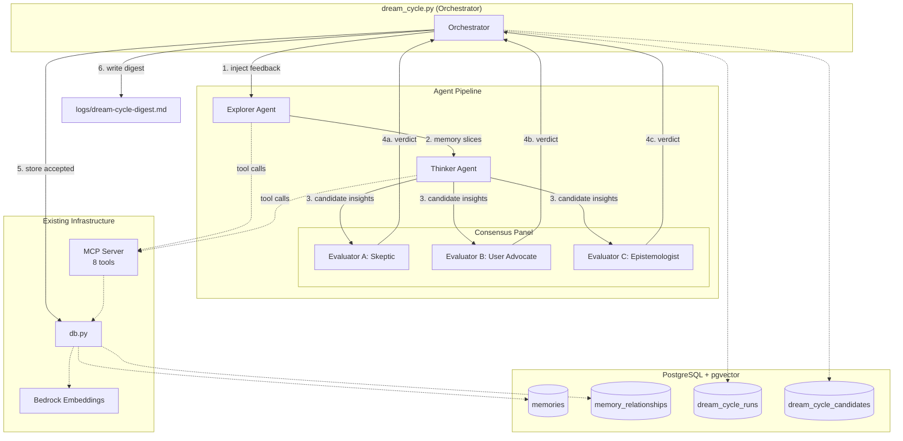
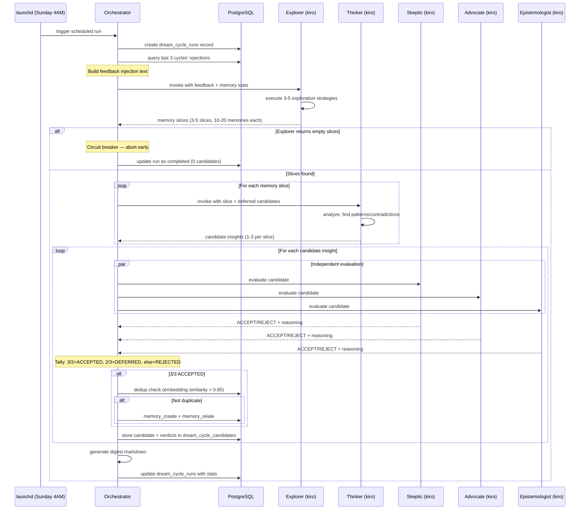
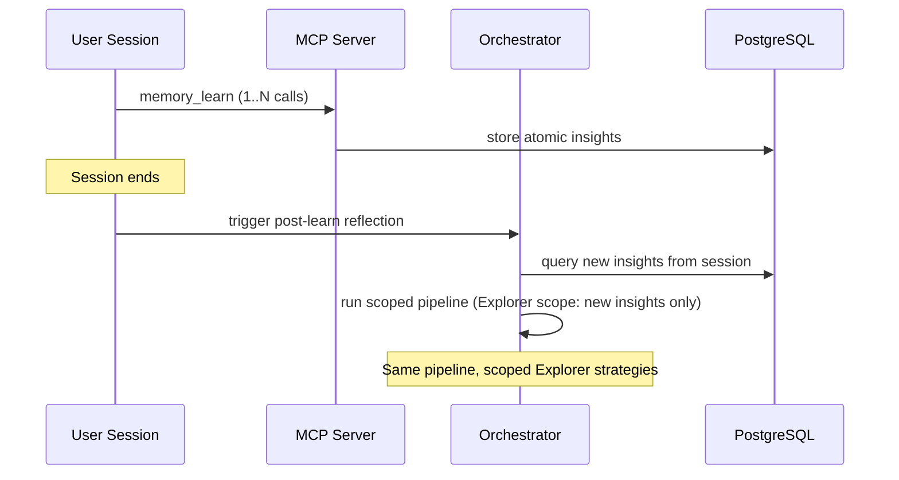

# Design Document: Dream Cycle — Multi-Agent Autonomous Learning

> **Note**: This spec has been partially superseded by the Byzantine Consensus Panel
> spec (`.kiro/specs/byzantine-consensus-panel/`). The consensus panel was upgraded
> from 3 to 4 evaluators with binary BFT consensus. The `generate_digest()` signature
> changed (deferred parameter removed). The `_is_second_deferral()` method was removed.
> Sequence diagrams and evaluator counts below reflect the original 3-evaluator design.
> See the BFT spec for the current implementation.

## Overview

The Dream Cycle adds autonomous, proactive learning to the Second Brain personal knowledge management system. Currently, the system's 74K+ memories in PostgreSQL + pgvector sit inert between interactions — learning only happens when the user explicitly triggers `memory_learn`. The Dream Cycle changes this: during downtime, a four-agent pipeline (Explorer → Thinker → Consensus Panel of 3 evaluators) examines the memory space, discovers hidden connections, surfaces contradictions, names implicit principles, and stores accepted insights as new semantic memories.

This design formalizes the architecture described in `docs/DESIGN-DECISIONS.md` (research grounding and architectural decisions). It specifies the module structure, function signatures, data flow, schema changes, and integration points needed to implement the Dream Cycle as a production feature within the existing Second Brain codebase.

The Dream Cycle implements the "Speed 3" tier of the Three-Speed Enrichment architecture: full deep LLM enrichment via weekly background processing. It complements the deterministic enrichment in V2 Tasks 3-6 (Speed 1 & 2) and replaces/extends V2 Task 8 (Consolidation Pipeline) with a more sophisticated multi-agent approach grounded in cognitive science (Stickgold 2005, Walker 2009) and multi-agent consensus research (Yao et al. 2025, Luo et al. 2025).

## Architecture

The Dream Cycle operates as a standalone orchestration layer that invokes the existing MCP server tools and database. Each agent runs as a separate `kiro --no-interactive` process for context isolation, failure isolation, and independent system prompts.



## Sequence Diagrams

### Main Weekly Dream Cycle Flow



### Post-Learn Reflection Flow




## Components and Interfaces

### Component 1: Orchestrator (`src/dream_cycle.py`)

**Purpose**: Coordinates the four-agent pipeline. Manages run lifecycle, feedback injection, inter-agent data flow, consensus tallying, deduplication, memory storage, and digest generation. This is the only component that writes to `dream_cycle_runs` and `dream_cycle_candidates`.

**Interface**:
```python
class DreamCycleOrchestrator:
    def run(self, run_type: str, scope: dict | None = None) -> DreamCycleResult:
        """Execute a full dream cycle pipeline.
        
        Args:
            run_type: 'scheduled', 'post_learn', 'session_start', 'user_triggered'
            scope: Optional scoping for non-scheduled runs (e.g., topic for user_triggered,
                   memory_ids for post_learn)
        Returns:
            DreamCycleResult with stats and digest path
        """
        ...

    def build_feedback_injection(self) -> str:
        """Query last 3 cycles' rejections from dream_cycle_candidates,
        format as the 'Lessons from recent cycles' text block."""
        ...

    def invoke_explorer(self, feedback: str, run_type: str, scope: dict | None) -> list[MemorySlice]:
        """Invoke Explorer agent via kiro --no-interactive.
        Returns parsed memory slices."""
        ...

    def invoke_thinker(self, slice: MemorySlice, deferred: list[dict]) -> list[CandidateInsight]:
        """Invoke Thinker agent with a memory slice + any deferred candidates.
        Returns parsed candidate insights."""
        ...

    def invoke_evaluator(self, candidate: CandidateInsight, role: str) -> EvaluatorVerdict:
        """Invoke a single evaluator (skeptic/advocate/epistemologist).
        Returns verdict + reasoning."""
        ...

    def tally_consensus(self, verdicts: list[EvaluatorVerdict]) -> str:
        """3/3=ACCEPTED, 2/3=DEFERRED, else=REJECTED."""
        ...

    def check_duplicate(self, content: str, threshold: float = 0.85) -> str | None:
        """Embedding similarity check against existing memories.
        Returns existing memory ID if duplicate found, None otherwise."""
        ...

    def store_accepted(self, candidate: CandidateInsight) -> str:
        """Create memory + relationships for an accepted insight.
        Handles CREATE/UPDATE/SUPERSEDE operations."""
        ...

    def generate_digest(self, run_id: str) -> str:
        """Generate static markdown digest. Write to logs/dream-cycle-digest-{date}.md.
        Returns file path."""
        ...
```

**Responsibilities**:
- Pipeline lifecycle management (create run record, update on completion)
- Feedback injection assembly from historical rejection data
- Sequential agent invocation (Explorer → Thinker per slice → Panel per candidate)
- Consensus tallying with 3/3 unanimous threshold
- Deduplication via embedding similarity before storing accepted insights
- Deferred insight management (2-strike expiration)
- Digest generation as static markdown
- Circuit breaker: abort if Explorer returns empty slices

### Component 2: Agent Invoker (`src/agent_invoker.py`)

**Purpose**: Abstraction layer for invoking `kiro --no-interactive` with a system prompt and input payload. Handles process spawning, timeout, output parsing, and error handling. Used by the orchestrator for all agent invocations.

**Interface**:
```python
class AgentInvoker:
    def invoke(self, system_prompt: str, user_message: str,
               mcp_config: dict | None = None, timeout: int = 300) -> AgentResponse:
        """Invoke kiro --no-interactive as a subprocess.
        
        Args:
            system_prompt: The agent's role prompt
            user_message: Input data (memory slices, candidates, etc.)
            mcp_config: MCP server config for tool access (Explorer/Thinker need it)
            timeout: Max seconds before killing the process
        Returns:
            AgentResponse with parsed output and raw text
        """
        ...

    def parse_json_output(self, raw: str) -> dict | list:
        """Extract JSON from agent output (handles markdown code fences)."""
        ...
```

**Responsibilities**:
- Subprocess management for `kiro --no-interactive`
- Timeout enforcement
- Output parsing (JSON extraction from markdown-wrapped responses)
- Error handling and logging

### Component 3: Dream Cycle Database Layer (`src/dream_cycle_db.py`)

**Purpose**: Database operations specific to the dream cycle. Extends `db.py` with dream-cycle-specific queries without modifying the core module.

**Interface**:
```python
def create_run(run_type: str) -> str:
    """Insert a new dream_cycle_runs record. Returns run UUID."""
    ...

def complete_run(run_id: str, stats: dict, digest: str) -> None:
    """Update run with completion time, stats, and digest text."""
    ...

def store_candidate(run_id: str, candidate: dict, verdicts: dict, final_verdict: str,
                    created_memory_id: str | None = None) -> str:
    """Insert a dream_cycle_candidates record. Returns candidate UUID."""
    ...

def get_recent_rejections(n_cycles: int = 3) -> list[dict]:
    """Query last N cycles' rejected/deferred candidates with evaluator reasoning.
    Used for feedback injection."""
    ...

def get_deferred_candidates(previous_run_id: str) -> list[dict]:
    """Get DEFERRED candidates from a specific run for re-evaluation."""
    ...

def mark_user_rejected(candidate_id: str, reason: str) -> None:
    """Mark an accepted insight as user-rejected post-hoc."""
    ...

def get_last_briefing_time() -> datetime | None:
    """Get the most recent session_start run's completed_at.
    Used for 24-hour frequency cap."""
    ...

def should_run_briefing() -> bool:
    """Check both conditions: (new memories OR dream cycle ran) AND 24h gap."""
    ...

def get_memory_stats() -> dict:
    """Aggregate stats for Explorer context: total count, date range,
    type distribution, recent activity."""
    ...

def get_golden_queries() -> list[dict]:
    """Extract 'Questions this answers' from accepted dream cycle insights
    for Tier 3 metrics."""
    ...

def get_tier1_metrics(n_cycles: int = 10) -> dict:
    """Compute Tier 1 process metrics from dream_cycle_runs and dream_cycle_candidates.
    Returns: acceptance_rate, acceptance_rate_trend, deferred_to_accepted_rate,
    strategy_diversity, cost_efficiency. All derivable via SQL aggregates."""
    ...

def get_tier2_metrics(n_cycles: int = 10) -> dict:
    """Compute Tier 2 engagement metrics.
    Returns: user_rejection_rate, rejection_reason_clusters,
    insight_citation_rate (access_count on dream-cycle-tagged memories).
    Note: digest read rate requires v2 interactive UX."""
    ...
```

**Responsibilities**:
- All dream_cycle_runs and dream_cycle_candidates CRUD
- Feedback injection queries (last 3 cycles' rejections with reasoning)
- Deferred candidate retrieval
- Briefing frequency enforcement
- Metrics data collection

### Component 4: Prompt Templates (`src/prompts/`)

**Purpose**: Store the full prompt templates for all agents. Prompts are defined in `docs/DREAM-CYCLE-DESIGN.md` (source of truth) and loaded here as Python string templates with variable interpolation.

**Interface**:
```python
# src/prompts/__init__.py
# src/prompts/explorer.py
# src/prompts/thinker.py
# src/prompts/panel.py

def get_explorer_prompt(memory_count: int, date_range: str,
                        feedback_injection: str, run_type: str,
                        scope: dict | None = None) -> str:
    """Build the Explorer system prompt with injected context."""
    ...

def get_thinker_prompt() -> str:
    """Return the Thinker system prompt (static)."""
    ...

def get_evaluator_prompt(role: str, candidate_json: str,
                         source_memories_content: str) -> str:
    """Build evaluator prompt for the given role (skeptic/advocate/epistemologist)."""
    ...
```

**Responsibilities**:
- Prompt template storage and interpolation
- Scoped prompt variants for different execution modes
- Prompt versioning (prompts reference `docs/DREAM-CYCLE-DESIGN.md` as source of truth)

## Data Models

### DreamCycleResult

```python
from dataclasses import dataclass
from datetime import datetime

@dataclass
class DreamCycleResult:
    run_id: str
    run_type: str  # scheduled, post_learn, session_start, user_triggered
    started_at: datetime
    completed_at: datetime
    candidates_generated: int
    candidates_accepted: int
    candidates_deferred: int
    candidates_rejected: int
    digest_path: str | None  # path to markdown digest file
    aborted_early: bool  # True if circuit breaker fired (empty slices)
```

### MemorySlice

```python
@dataclass
class MemorySlice:
    name: str                    # e.g., "Cross-project database decisions"
    strategy: str                # e.g., "cross_project_collision"
    memory_ids: list[str]        # UUIDs of included memories
    memory_titles: list[str]     # Titles for logging/digest
    hypothesis: str              # 1-2 sentence hypothesis for the Thinker
```

### CandidateInsight

```python
@dataclass
class CandidateInsight:
    title: str
    type: str                    # insight, connection, question, synthesis
    operation: str               # CREATE, UPDATE, SUPERSEDE
    target_memory_id: str | None # for UPDATE/SUPERSEDE
    supersedes_reason: str | None
    schema_operation: str        # assimilation, accommodation
    schema_note: str
    confidence: str              # high, medium, low
    confidence_reasoning: str
    content: str                 # Full insight text with depth framework
    source_memories: list[str]   # UUIDs
    relationships: list[dict]    # [{target_id, relation_type, note}]
    strategy_that_found_it: str
```

### EvaluatorVerdict

```python
@dataclass
class EvaluatorVerdict:
    role: str       # skeptic, advocate, epistemologist
    verdict: str    # ACCEPT, REJECT
    reasoning: str  # Full reasoning text
```

### Schema: dream_cycle_runs

```sql
CREATE TABLE dream_cycle_runs (
    id UUID PRIMARY KEY DEFAULT gen_random_uuid(),
    run_type TEXT NOT NULL,          -- scheduled, post_learn, session_start, user_triggered
    started_at TIMESTAMPTZ DEFAULT now(),
    completed_at TIMESTAMPTZ,
    explorer_output JSONB,           -- memory slices assembled
    explorer_feedback_injected TEXT,  -- the "Lessons from recent cycles" text
    candidates_generated INTEGER,
    candidates_accepted INTEGER,
    candidates_deferred INTEGER,
    candidates_rejected INTEGER,
    digest TEXT                       -- human-readable summary
);
```

### Schema: dream_cycle_candidates

```sql
CREATE TABLE dream_cycle_candidates (
    id UUID PRIMARY KEY DEFAULT gen_random_uuid(),
    run_id UUID REFERENCES dream_cycle_runs(id),
    candidate_json JSONB,            -- the Thinker's full output
    operation TEXT,                   -- CREATE, UPDATE, SUPERSEDE
    target_memory_id UUID,           -- for UPDATE/SUPERSEDE
    schema_operation TEXT,            -- assimilation, accommodation
    evaluator_a_verdict TEXT,
    evaluator_a_reasoning TEXT,
    evaluator_b_verdict TEXT,
    evaluator_b_reasoning TEXT,
    evaluator_c_verdict TEXT,
    evaluator_c_reasoning TEXT,
    final_verdict TEXT,               -- ACCEPTED, DEFERRED, REJECTED
    created_memory_id UUID REFERENCES memories(id),
    user_rejected_at TIMESTAMPTZ,
    user_rejection_reason TEXT,
    deferred_twice_rejected BOOLEAN DEFAULT FALSE,
    created_at TIMESTAMPTZ DEFAULT now()
);
```

### Schema: Relationship temporal awareness

```sql
-- Zep bi-temporal model for relationship lifecycle
ALTER TABLE memory_relationships ADD COLUMN IF NOT EXISTS expired_at TIMESTAMPTZ;
```

**Validation Rules**:
- `run_type` must be one of: scheduled, post_learn, session_start, user_triggered
- `final_verdict` must be one of: ACCEPTED, DEFERRED, REJECTED
- `operation` must be one of: CREATE, UPDATE, SUPERSEDE
- `schema_operation` must be one of: assimilation, accommodation
- For SUPERSEDE operations, `target_memory_id` must reference an existing active memory
- Deferred candidates that fail consensus a second time get `deferred_twice_rejected = TRUE`

## Algorithmic Pseudocode

### Main Orchestration Algorithm

```python
def run_dream_cycle(run_type: str, scope: dict | None = None) -> DreamCycleResult:
    """
    Preconditions:
        - Database is reachable
        - kiro CLI is available on PATH
        - MCP server config exists at ~/.kiro/settings/mcp.json
        - For session_start: should_run_briefing() returns True
    
    Postconditions:
        - dream_cycle_runs record created and completed
        - All accepted insights stored as memories with relationships
        - Deferred candidates logged with dissenting reasoning preserved
        - Digest file written (for scheduled/user_triggered runs)
        - No duplicate memories created (embedding similarity check)
    """
    run_id = create_run(run_type)
    
    # Step 1: Build feedback from historical rejections
    feedback = build_feedback_injection()  # last 3 cycles
    
    # Step 2: Invoke Explorer
    stats = get_memory_stats()
    slices = invoke_explorer(feedback, run_type, scope, stats)
    
    # Circuit breaker: empty slices = nothing interesting to examine
    if not slices:
        complete_run(run_id, stats={"aborted": True}, digest="")
        return DreamCycleResult(aborted_early=True, ...)
    
    # Step 3: Get deferred candidates from previous cycle (if any)
    previous_run = get_previous_run(run_type)
    deferred = get_deferred_candidates(previous_run.id) if previous_run else []
    
    all_candidates = []
    
    # Step 4: Invoke Thinker for each slice
    for slice in slices:
        candidates = invoke_thinker(slice, deferred)
        all_candidates.extend(candidates)
    
    accepted, deferred_new, rejected = [], [], []
    
    # Step 5: Consensus Panel for each candidate
    for candidate in all_candidates:
        # Invoke all 3 evaluators independently (can be parallel)
        verdicts = [
            invoke_evaluator(candidate, "skeptic"),
            invoke_evaluator(candidate, "advocate"),
            invoke_evaluator(candidate, "epistemologist"),
        ]
        
        final = tally_consensus(verdicts)  # 3/3, 2/3, or <2/3
        
        if final == "ACCEPTED":
            # Deduplication check before storing
            existing = check_duplicate(candidate.content, threshold=0.85)
            if existing is None:
                memory_id = store_accepted(candidate)
            else:
                memory_id = None  # skip, log as "already known"
            
            store_candidate(run_id, candidate, verdicts, "ACCEPTED", memory_id)
            accepted.append(candidate)
        
        elif final == "DEFERRED":
            # Check if this was already deferred once (2-strike rule)
            if is_second_deferral(candidate, deferred):
                store_candidate(run_id, candidate, verdicts, "REJECTED")
                # Mark deferred_twice_rejected for Tier 1 metrics
                rejected.append(candidate)
            else:
                store_candidate(run_id, candidate, verdicts, "DEFERRED")
                deferred_new.append(candidate)
        
        else:  # REJECTED
            store_candidate(run_id, candidate, verdicts, "REJECTED")
            rejected.append(candidate)
    
    # Step 6: Generate digest
    digest = generate_digest(run_id, accepted, deferred_new, rejected)
    complete_run(run_id, stats={...}, digest=digest)
    
    return DreamCycleResult(
        candidates_generated=len(all_candidates),
        candidates_accepted=len(accepted),
        candidates_deferred=len(deferred_new),
        candidates_rejected=len(rejected),
        digest_path=digest,
        ...
    )
```

**Loop Invariants:**
- For the slice loop: all previously processed slices have their candidates collected
- For the candidate loop: all previously processed candidates have verdicts stored in `dream_cycle_candidates`
- Deferred candidates from the previous cycle are only processed once per run

### Feedback Injection Algorithm

```python
def build_feedback_injection() -> str:
    """
    Preconditions:
        - Database is reachable
    
    Postconditions:
        - Returns formatted text block with rejection/deferral reasons from last 3 cycles
        - Returns empty string if no previous cycles exist
        - Includes actual evaluator reasoning (Reflexion principle: specific verbal feedback)
    """
    rejections = get_recent_rejections(n_cycles=3)
    
    if not rejections:
        return ""
    
    sections = []
    for cycle in group_by_run(rejections):
        lines = [f"Cycle {cycle.date}: {cycle.accepted} accepted, "
                 f"{cycle.rejected} rejected, {cycle.deferred} deferred"]
        
        for rejection in cycle.rejections:
            lines.append(
                f"- {rejection.evaluator_role} rejected for "
                f"{rejection.reason_category}: \"{rejection.reasoning}\""
            )
        
        sections.append("\n".join(lines))
    
    return "## Lessons from recent cycles (last 3 runs)\n\n" + "\n\n".join(sections)
```

### Deduplication Algorithm

```python
def check_duplicate(content: str, threshold: float = 0.85) -> str | None:
    """
    Preconditions:
        - content is non-empty
        - threshold is between 0.0 and 1.0
    
    Postconditions:
        - Returns existing memory ID if embedding similarity > threshold
        - Returns None if no duplicate found
        - Only checks against active, non-chunk memories (parent_id IS NULL)
    """
    embedding = generate_embedding(content)
    similar = search_similar(embedding, limit=5, status="active")
    
    for result in similar:
        if result.get("parent_id") is not None:
            continue  # skip chunks
        similarity = result.get("similarity", 0)
        if similarity > threshold:
            return str(result["id"])
    
    return None
```

### Store Accepted Insight Algorithm

```python
def store_accepted(candidate: CandidateInsight) -> str:
    """
    Preconditions:
        - candidate passed 3/3 consensus
        - deduplication check returned None (no duplicate)
        - For UPDATE/SUPERSEDE: target_memory_id exists and is active
    
    Postconditions:
        - For CREATE: new memory exists with embedding, tags include strategy
        - For UPDATE: target memory content updated, re-embedded
        - For SUPERSEDE: new memory created, old memory status='superseded',
          'superseded_by' relationship created, old memory annotated
        - All proposed relationships created
        - Memory tagged with 'dream-cycle' and schema_operation
    """
    if candidate.operation == "CREATE":
        embedding = generate_embedding(candidate.content)
        memory_id = create_memory(
            type=candidate.type,
            title=candidate.title,
            content=candidate.content,
            embedding=embedding,
            tags=["dream-cycle", candidate.schema_operation],
            metadata={
                "dream_cycle": True,
                "strategy": candidate.strategy_that_found_it,
                "source_memories": candidate.source_memories,
                "confidence": candidate.confidence,
            },
        )
    
    elif candidate.operation == "UPDATE":
        update_memory(candidate.target_memory_id,
                      content=candidate.content,
                      metadata={"last_dream_cycle_update": now_iso()})
        memory_id = candidate.target_memory_id
    
    elif candidate.operation == "SUPERSEDE":
        # Create new memory
        embedding = generate_embedding(candidate.content)
        memory_id = create_memory(
            type=candidate.type,
            title=candidate.title,
            content=candidate.content,
            embedding=embedding,
            tags=["dream-cycle", candidate.schema_operation],
            metadata={"dream_cycle": True, "supersedes": candidate.target_memory_id},
        )
        # Mark old memory as superseded
        update_memory(candidate.target_memory_id, status="superseded")
        create_relationship(candidate.target_memory_id, memory_id,
                           "superseded_by", candidate.supersedes_reason)
    
    # Create all proposed relationships
    for rel in candidate.relationships:
        create_relationship(memory_id, rel["target_id"],
                           rel["relation_type"], rel.get("note"))
    
    return memory_id
```

## Key Functions with Formal Specifications

### Function: invoke_explorer()

```python
def invoke_explorer(feedback: str, run_type: str,
                    scope: dict | None, stats: dict) -> list[MemorySlice]:
    ...
```

**Preconditions:**
- `feedback` is a string (may be empty for first-ever run)
- `run_type` is one of: scheduled, post_learn, session_start, user_triggered
- `stats` contains keys: memory_count, date_range, type_distribution
- kiro CLI is available and authenticated

**Postconditions:**
- Returns 0-5 MemorySlice objects
- Each slice contains 10-20 memory IDs that exist in the database
- Each slice names the strategy used (one of the 11 defined strategies)
- For session_start: only strategies 6, 8, 10 are used
- For post_learn: Explorer scope limited to new insights + their neighbors
- Empty list triggers circuit breaker in orchestrator

### Function: invoke_thinker()

```python
def invoke_thinker(slice: MemorySlice,
                   deferred: list[dict]) -> list[CandidateInsight]:
    ...
```

**Preconditions:**
- `slice` contains valid memory IDs with at least 3 memories
- `deferred` contains candidates from previous cycle with dissenting reasoning
- kiro CLI is available and authenticated

**Postconditions:**
- Returns 0-3 CandidateInsight objects per slice
- Each candidate has complete depth framework (WHAT, EVIDENCE, WHY IT MATTERS)
- Each candidate has "Questions this answers" section
- For UPDATE/SUPERSEDE: target_memory_id references an existing memory
- Empty list is valid (slice yielded nothing non-obvious)

### Function: invoke_evaluator()

```python
def invoke_evaluator(candidate: CandidateInsight, role: str) -> EvaluatorVerdict:
    ...
```

**Preconditions:**
- `candidate` is a complete CandidateInsight
- `role` is one of: skeptic, advocate, epistemologist
- Source memories referenced by candidate exist in database

**Postconditions:**
- Returns exactly one EvaluatorVerdict
- Verdict is either "ACCEPT" or "REJECT" (no "maybe")
- Reasoning is non-empty and addresses the role-specific criteria
- Evaluator has no access to other evaluators' verdicts (independent evaluation)

### Function: generate_digest()

```python
def generate_digest(run_id: str, accepted: list, deferred: list,
                    rejected: list) -> str:
    ...
```

**Preconditions:**
- `run_id` references a valid dream_cycle_runs record
- All candidates have been processed and stored

**Postconditions:**
- Returns file path to written markdown digest
- Digest grouped by strategy type (not confidence-ordered)
- Each accepted insight includes: 1-line summary, full content, source memory links, evaluator reasoning
- UPDATE/SUPERSEDE operations show diff with link to original
- Run statistics included (generated/accepted/deferred/rejected)
- File written to `logs/dream-cycle-digest-{date}.md`

## Example Usage

```python
# === Weekly scheduled run (triggered by launchd) ===
from src.dream_cycle import DreamCycleOrchestrator

orch = DreamCycleOrchestrator()
result = orch.run(run_type="scheduled")

print(f"Generated: {result.candidates_generated}")
print(f"Accepted: {result.candidates_accepted}")
print(f"Digest: {result.digest_path}")
# Generated: 8
# Accepted: 3
# Digest: logs/dream-cycle-digest-2026-03-23.md


# === Session-start briefing (called at session init) ===
from src.dream_cycle_db import should_run_briefing

if should_run_briefing():
    result = orch.run(run_type="session_start")
    if not result.aborted_early and result.candidates_accepted > 0:
        print(open(result.digest_path).read())


# === User-triggered deep dive ===
result = orch.run(run_type="user_triggered", scope={"topic": "database migration patterns"})


# === Post-learn reflection (after session with memory_learn calls) ===
result = orch.run(run_type="post_learn", scope={
    "memory_ids": ["uuid1", "uuid2", "uuid3"]  # new insights from this session
})


# === User rejects an insight from the digest ===
from src.dream_cycle_db import mark_user_rejected

mark_user_rejected(candidate_id="uuid", reason="Too obvious — I already know this")


# === Golden query metrics (monthly analysis) ===
from src.dream_cycle_db import get_golden_queries
from src.db import hybrid_search, rerank

queries = get_golden_queries()
for q in queries:
    results = hybrid_search(q["query"], q["embedding"], limit=10)
    results = rerank(results, q["query"])
    # Log rank position of the dream-cycle insight, co-results, rerank scores
```

## Correctness Properties

*A property is a characteristic or behavior that should hold true across all valid executions of a system — essentially, a formal statement about what the system should do. Properties serve as the bridge between human-readable specifications and machine-verifiable correctness guarantees.*

### Property 1: Consensus Tally Correctness

*For any* list of 3 evaluator verdicts (each ACCEPT or REJECT), `tally_consensus` returns ACCEPTED if and only if all 3 are ACCEPT, DEFERRED if and only if exactly 2 are ACCEPT, and REJECTED otherwise. The function is total — it produces exactly one result for every valid input.

**Validates: Requirements 1.4, 2.1, 2.2, 2.3**

### Property 2: Deduplication Guarantee

*For any* accepted insight content string, `check_duplicate` returns an existing memory ID if and only if there exists an active, non-chunk memory (parent_id IS NULL, status = 'active') with embedding similarity > 0.85. When a duplicate is found, no new memory is created.

**Validates: Requirements 7.2, 7.3, 7.4**

### Property 3: Feedback Loop Completeness

*For any* database state containing N previous dream cycle runs (N ≥ 1), `build_feedback_injection` returns a string containing the actual evaluator reasoning text from rejected and deferred candidates of the last min(N, 3) cycles. For an empty database (N = 0), it returns an empty string.

**Validates: Requirements 4.1, 4.2**

### Property 4: Two-Strike Expiration

*For any* candidate that was DEFERRED in cycle N, if it fails consensus again in cycle N+1, the Orchestrator marks it as REJECTED with `deferred_twice_rejected = TRUE`. No candidate survives more than 2 consecutive deferrals.

**Validates: Requirements 10.4, 18.4**

### Property 5: Circuit Breaker

*For any* dream cycle run where the Explorer returns 0 memory slices, the Orchestrator completes the run with `candidates_generated = 0`, `aborted_early = TRUE`, and zero Thinker or Panel invocations.

**Validates: Requirements 9.1, 9.2, 9.3**

### Property 6: Evaluator Independence

*For any* candidate being evaluated, no evaluator's prompt contains another evaluator's verdict or reasoning. Additionally, Explorer and Thinker agents receive MCP configuration while evaluator agents do not.

**Validates: Requirements 2.4, 13.4**

### Property 7: SUPERSEDE Consistency

*For any* accepted SUPERSEDE operation, the old memory's status is set to 'superseded', a 'superseded_by' relationship is created from old → new, and all of the old memory's pre-existing relationships are preserved unchanged.

**Validates: Requirements 8.3, 8.4, 15.2, 15.5**

### Property 8: Session-Start Frequency Cap

*For any* session_start run attempt, the Orchestrator permits execution if and only if both conditions hold: (a) the previous session_start run's completed_at is more than 24 hours ago, and (b) either new memories exist or a dream cycle completed since the last session.

**Validates: Requirements 11.5, 11.6**

### Property 9: Idempotent Storage

*For any* dream cycle run, running the same pipeline twice with identical Explorer output produces at most the same set of memories — the deduplication check prevents creation of duplicate memories across runs.

**Validates: Requirements 7.2, 7.3**

### Property 10: Run Record Completeness

*For any* completed dream cycle run, the `dream_cycle_runs` record has non-null `completed_at`, accurate candidate counts (generated = accepted + deferred + rejected), and every processed candidate has a corresponding `dream_cycle_candidates` record with all 3 evaluator verdicts and reasoning.

**Validates: Requirements 1.5, 1.6, 2.5**

### Property 11: CREATE Storage Correctness

*For any* accepted CREATE candidate, the resulting memory has an embedding, tags containing 'dream-cycle' and the schema_operation value, metadata containing the strategy name, source memory IDs, and confidence level, and all proposed relationships are created.

**Validates: Requirements 8.1, 8.5**

### Property 12: Digest Completeness

*For any* set of accepted, deferred, and rejected candidates from a completed run, the generated digest groups insights by strategy type (not confidence), includes a 1-line summary, full content, source memory links, and evaluator reasoning for each accepted insight, shows diffs for UPDATE/SUPERSEDE operations, and includes run statistics and Explorer strategy summary.

**Validates: Requirements 12.2, 12.3, 12.4, 12.5, 12.6**

### Property 13: JSON Output Parsing

*For any* agent output string containing valid JSON (whether bare, wrapped in markdown code fences, or preceded/followed by non-JSON text), `parse_json_output` extracts and returns the valid JSON object or array.

**Validates: Requirement 13.3**

### Property 14: User Rejection Preserves Memory

*For any* user rejection of an accepted dream cycle insight, the memory continues to exist in the database with status 'user_rejected', and the rejection timestamp and reason are recorded in the `dream_cycle_candidates` record without deleting the memory.

**Validates: Requirements 14.5, 15.4**

### Property 15: Prompt Template Interpolation

*For any* valid set of interpolation variables (memory_count, date_range, feedback_injection, run_type, scope), the Explorer prompt template produces a non-empty string containing all interpolated values. For session_start mode, the prompt restricts available strategies to 6, 8, and 10.

**Validates: Requirements 17.2, 17.4, 17.5**

## Error Handling

### Error Scenario 1: Explorer Agent Failure

**Condition**: kiro --no-interactive process crashes, times out, or returns unparseable output
**Response**: Log error with full stderr. Mark run as completed with `explorer_output: {"error": "..."}`. Set all candidate counts to 0.
**Recovery**: Next scheduled run starts fresh. No state corruption because Explorer is stateless.

### Error Scenario 2: Thinker Agent Failure (Single Slice)

**Condition**: Thinker crashes or returns unparseable output for one memory slice
**Response**: Log error. Skip this slice. Continue processing remaining slices. Record partial results.
**Recovery**: The skipped slice's memories will be available for future cycles. No data loss.

### Error Scenario 3: Evaluator Agent Failure

**Condition**: An evaluator crashes, times out, or returns unparseable output
**Response**: Retry the evaluator up to `EVALUATOR_MAX_ATTEMPTS` (transient flakes — a kiro hiccup or Bedrock throttle — usually clear on retry). If it still fails, abort the run loudly (`aborted_early=True`, exit 2, notification) — do NOT fabricate a verdict. A crash is an *omission* (no vote), not a *commission* (a bad vote); recording it as REJECT would spend the panel's f=1 Byzantine budget on a non-Byzantine event. Candidates evaluated before the abort are preserved (accurate partial stats — no orphaned memories against a zeroed run row).
**Recovery**: The abort notification surfaces the infra failure for a fix; the next scheduled cycle re-examines the memories. The ≥3/4 quorum continues to tolerate one genuine bad *vote*.

### Error Scenario 4: Deduplication False Positive

**Condition**: Embedding similarity > 0.85 but the memories are genuinely distinct
**Response**: Insight is skipped (not stored). Logged as "already known" with the matched memory ID.
**Recovery**: The 0.85 threshold is tunable. After the first 3-4 cycles, review logs to calibrate. If legitimate insights are being blocked, lower the threshold.

### Error Scenario 5: Database Connection Failure Mid-Run

**Condition**: PostgreSQL becomes unreachable during pipeline execution
**Response**: Current operation fails. Orchestrator catches the exception, logs it, and attempts to update the run record (which may also fail). Exit with code 2 (total failure).
**Recovery**: Weekly cadence means the cost is one week's delay. The `dream_cycle_runs` record may be incomplete — the next run starts fresh regardless.

### Error Scenario 6: SUPERSEDE Target Memory Not Found

**Condition**: Thinker proposes SUPERSEDE on a memory ID that no longer exists or is already superseded
**Response**: Downgrade to CREATE operation. Log warning. Store the insight as a new memory without the supersession chain.
**Recovery**: Automatic — the insight is preserved even if the supersession chain is broken.

## Testing Strategy

### Unit Testing Approach

Test the orchestrator logic, consensus tallying, deduplication, feedback injection, and digest generation without invoking real kiro processes or LLMs.

Key test cases:
- `test_tally_consensus_3_accept` → ACCEPTED
- `test_tally_consensus_2_accept` → DEFERRED
- `test_tally_consensus_1_accept` → REJECTED
- `test_tally_consensus_0_accept` → REJECTED
- `test_circuit_breaker_empty_slices` → aborted_early=True, no Thinker/Panel calls
- `test_dedup_blocks_similar_content` → existing memory found, skip creation
- `test_dedup_allows_distinct_content` → no match, proceed with creation
- `test_feedback_injection_formats_rejections` → correct markdown format
- `test_feedback_injection_empty_first_run` → returns empty string
- `test_two_strike_expiration` → deferred twice → REJECTED with flag
- `test_supersede_creates_chain` → old memory superseded, relationship created
- `test_store_accepted_create` → memory created with correct tags/metadata
- `test_store_accepted_update` → target memory content updated
- `test_briefing_frequency_cap` → skip if < 24h since last briefing
- `test_digest_grouped_by_strategy` → not ordered by confidence

### Property-Based Testing Approach

**Property Test Library**: hypothesis (Python)

Properties to test:
- For any list of 3 EvaluatorVerdicts, tally_consensus returns exactly one of ACCEPTED/DEFERRED/REJECTED
- For any CandidateInsight with operation=SUPERSEDE, store_accepted always creates a superseded_by relationship
- For any feedback injection output, all referenced run IDs exist in dream_cycle_runs
- Deduplication threshold is symmetric: check_duplicate(a) finding b implies check_duplicate(b) would find a (within floating point tolerance)

### Integration Testing Approach

Integration tests use a test database (same local PostgreSQL instance, separate DB) with mock agent responses:

- `test_full_pipeline_with_mock_agents` → orchestrator runs end-to-end with deterministic agent outputs, verifies all database records created correctly
- `test_post_learn_scoped_run` → verifies Explorer receives scoped prompt
- `test_session_start_with_frequency_cap` → verifies 24h cap enforcement
- `test_deferred_reeval_across_cycles` → run two cycles, verify deferred candidate re-enters second cycle
- `test_user_rejection_feeds_back` → reject an insight, verify it appears in next cycle's feedback injection

## Performance Considerations

- **Cost budget**: Weekly cycle: 13-24 kiro sessions. Session-start: 5-8 sessions. Post-learn: 5-9 sessions. Circuit breaker prevents wasted sessions on unchanged memory spaces.
- **Timeout enforcement**: Each agent invocation has a 5-minute timeout. Total pipeline timeout of 60 minutes for scheduled runs.
- **Parallel evaluation**: The 3 evaluators for each candidate can run in parallel (separate processes, no shared state). This reduces wall-clock time by ~3x for the Panel phase.
- **Embedding generation**: Deduplication check requires one embedding generation per accepted candidate. Batch if multiple candidates accepted in same cycle.
- **Database load**: Explorer may issue 10-20 queries. Thinker may issue 5-10 per slice. All use existing indexed queries. No full table scans.

## Security Considerations

- **No PII in prompts**: Agent prompts contain memory IDs and content from the user's own knowledge base. No external PII.
- **Process isolation**: Each agent runs as a separate kiro process. No shared memory between evaluators.
- **Credential handling**: kiro CLI handles its own auth. No credentials stored in dream cycle code.
- **Digest file permissions**: Written to `logs/` directory with standard file permissions. Contains user's own knowledge — no additional access control needed for a personal system.

## Dependencies

- **Existing modules**: `src/db.py` (CRUD, search, rerank), `src/embeddings.py` (Bedrock embedding generation), `src/mcp_server.py` (MCP tools used by agents)
- **External**: `kiro` CLI (--no-interactive mode for agent invocation), PostgreSQL + pgvector (native, localhost), Amazon Bedrock (embeddings)
- **Python stdlib**: `subprocess` (agent invocation), `json` (data serialization), `datetime`, `pathlib`, `logging`
- **New tables**: `dream_cycle_runs`, `dream_cycle_candidates` (migration required)
- **Schema changes**: `expired_at` column on `memory_relationships` (migration required)
- **V2 Task dependencies**: Tasks 3-6 (classification, depth scoring, project scoping, relationship discovery) provide the deterministic enrichment that the dream cycle builds on. The dream cycle can run without them but produces better results with them.

## Module Structure

New files to create:

```
src/
├── dream_cycle.py          # Orchestrator: pipeline lifecycle, consensus, digest
├── dream_cycle_db.py       # Dream-cycle-specific DB operations
├── agent_invoker.py        # kiro --no-interactive subprocess wrapper
├── prompts/
│   ├── __init__.py
│   ├── explorer.py         # Explorer prompt template + interpolation
│   ├── thinker.py          # Thinker prompt template + interpolation
│   └── panel.py            # 3 evaluator prompt templates + interpolation
scripts/
├── dream_cycle_run.py      # CLI entry point for all execution modes
├── golden_queries.py       # Tier 3 monthly metrics script
migrations/
├── 003_dream_cycle.sql     # dream_cycle_runs + dream_cycle_candidates + expired_at
scheduling/
├── com.second-brain.dream-cycle.plist  # Weekly Sunday 4AM launchd job
tests/
├── test_dream_cycle.py     # Orchestrator unit tests
├── test_dream_cycle_db.py  # DB layer tests
├── test_agent_invoker.py   # Invoker tests with mock subprocess
├── test_consensus.py       # Consensus tallying + dedup property tests
```

Files modified:
- `src/db.py` — add `expired_at` to relationship queries where relevant
- `src/mcp_server.py` — no changes (agents use MCP tools via kiro, not direct imports)

## Integration Points

### Three-Speed Enrichment Mapping

| Speed | Trigger | Enrichment | Implementation |
|-------|---------|-----------|----------------|
| Speed 1 | Interactive `memory_create` | LLM: contradiction check, relationship discovery | V2 Tasks 3-6 (fast path) |
| Speed 2 | Batch ingestion | Deterministic: classify, depth score, project tag | V2 Tasks 3-5 (fast path) |
| Speed 3 | Dream Cycle | Full deep LLM: all 11 strategies, consensus-gated | This feature (slow path) |

### Relationship to V2 Tasks

- **Tasks 3-6** (classification, depth, project, relationships): Provide the metadata the Explorer uses for strategies 7 (depth gradient), 5 (project collision), 3 (orphan archaeology). Dream cycle works without them but is more effective with them.
- **Task 8** (Consolidation Pipeline): The dream cycle replaces and extends Task 8. The Thinker's distillation capability (strategy 9 in the Thinker prompt) subsumes the clustering + template + synthesize pipeline. The dream cycle adds consensus gating, feedback loops, and multi-strategy exploration that Task 8 lacked.
- **Task 2** (Spaced Retrieval): Dream cycle insights get `access_count` tracking like any other memory. The spacing bonus applies to dream-cycle-created memories too.

### Execution Mode Triggers

| Mode | Trigger | Frequency | Explorer Scope |
|------|---------|-----------|----------------|
| Scheduled | launchd (Sunday 4AM) | Weekly | All 11 strategies |
| Post-Learn | Manual CLI: `dream_cycle_run.py --run-type post_learn --memory-ids ...` (v1). Automatic session-end detection is v2. | Per session (batched) | New insights + neighbors |
| Session-Start | Session init | ≤1 per 24h, conditional | Strategies 6, 8, 10 only |
| User-Triggered | User says "reflect on X" | On demand | All strategies, topic-scoped |

### kiro --no-interactive Invocation Pattern

Each agent is invoked as a separate kiro CLI process:

```bash
# Explorer (needs MCP tools for memory_search, memory_list, memory_read, memory_graph)
echo "$EXPLORER_INPUT" | kiro --no-interactive \
  --system-prompt "$EXPLORER_SYSTEM_PROMPT" \
  --mcp-config ~/.kiro/settings/mcp.json

# Thinker (needs MCP tools for memory_search, memory_read, memory_graph)
echo "$THINKER_INPUT" | kiro --no-interactive \
  --system-prompt "$THINKER_SYSTEM_PROMPT" \
  --mcp-config ~/.kiro/settings/mcp.json

# Evaluators (no MCP tools needed — they receive all context in the prompt)
echo "$EVALUATOR_INPUT" | kiro --no-interactive \
  --system-prompt "$EVALUATOR_SYSTEM_PROMPT"
```

The orchestrator passes data between stages via JSON. Explorer output → parsed into MemorySlice objects → serialized as Thinker input. Thinker output → parsed into CandidateInsight objects → serialized as Evaluator input. All intermediate state is also persisted to `dream_cycle_candidates` for observability and crash recovery.
