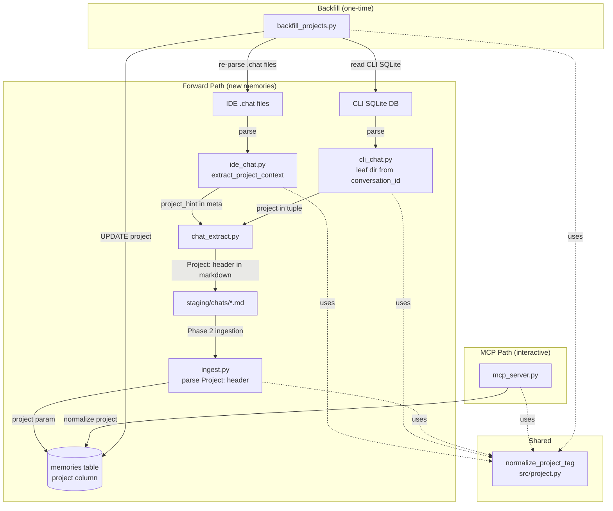

# Design Document: Project Auto-Tagging

## Overview

This feature closes the loop on the Second Brain's project-scoping infrastructure. The `project` column, cross-project rerank penalty (-0.15), and project filter in `hybrid_search` are all implemented but inert because nothing populates the `project` field. This design covers four concerns:

1. **Forward path**: Wire project extraction through the IDE and CLI chat parsers → `chat_extract.py` → `ingest_content()` → `create_memory()` so new memories get tagged automatically.
2. **Backfill**: A one-time script that re-derives project tags for 74K existing memories from original source data (re-parsing `.chat` files, reading CLI SQLite DB).
3. **Normalization**: A shared `normalize_project_tag()` function that enforces consistent casing, strips whitespace, excludes dot-prefixed directories and home/root paths, and is applied at every entry point (parsers, ingestion, MCP tools, backfill).
4. **Query-side normalization**: The MCP `memory_search` and `memory_create` tools normalize incoming `project` parameters before passing them downstream.

The design is intentionally minimal — the column, index, rerank penalty, and search filter already exist. The work is plumbing and data repair.

## Architecture



### Key Design Decision: Shared Normalization Function

All project tag derivation flows through a single `normalize_project_tag(raw_value)` function in `src/project.py`. This eliminates the risk of inconsistent normalization across parsers, ingestion, MCP tools, and backfill. The function is pure (no I/O) and independently testable.

### Key Design Decision: Re-parse from Source, Don't Guess from Metadata

The backfill script re-parses original `.chat` files from disk rather than trying to infer projects from the `metadata` JSONB column. Rationale: the metadata JSONB has 34,145 entries with `project: ".kiro"` (useless) and zero entries with the actual `project_hint` value. The `.chat` files on disk still contain the `fileTree` context that `extract_project_context()` reads. For CLI chats, the SQLite `conversation_id` is the authoritative workspace path.

### Key Design Decision: Parent-First Backfill Processing

The backfill script processes parent memories before children (chunks). Children inherit their parent's project tag. This ensures parent-child consistency without needing a second pass.

## Components and Interfaces

### 1. `src/project.py` (NEW)

Pure normalization module. Single function, no dependencies.

```python
def normalize_project_tag(raw: str | None) -> str | None:
    """Normalize a raw project tag value.
    
    Rules:
    1. None → None
    2. Strip whitespace, lowercase
    3. Extract final path component (split on / and \\)
    4. Empty string after normalization → None
    5. Dot-prefixed (e.g. .kiro, .git) → None
    6. If original path is absolute (starts with /) and has < 3 components → None (home dir / root)
       This rule does NOT apply to relative paths or bare names (e.g. "RetailStore").
    
    Returns normalized tag or None.
    """
```

### 2. `src/parsers/ide_chat.py` (MODIFIED)

Changes:
- `extract_project_context()`: Apply `normalize_project_tag()` to the extracted `project_hint` before returning. Currently returns raw directory name; will return normalized value.
- `format_as_markdown()`: Already emits `Project:` header when `project_hint` is truthy — no change needed.
- `parse_chat_file()`: Already returns `meta` dict containing `project_hint` — no change needed.

The existing `extract_project_context()` extracts the first path component from `expandedPaths[0]`. This logic stays; we just wrap the result in `normalize_project_tag()`.

### 3. `src/parsers/cli_chat.py` (MODIFIED)

Changes:
- `parse_conversation()`: Extract project from `conversation_id` (workspace path) using `normalize_project_tag()`. Include `Project:` header in markdown output.
- `format_as_markdown()`: Accept optional `project` parameter, emit `Project:` header when non-NULL.
- `parse_all()`: Yield 3-tuples `(conv_id, markdown, project)` instead of 2-tuples `(conv_id, markdown)`.

The `conversation_id` in the SQLite DB IS the workspace directory path (e.g., `/Users/example/Projects/RetailStore`). `normalize_project_tag()` extracts `retailstore` from this.

### 4. `scripts/chat_extract.py` (MODIFIED)

Changes:
- CLI chat loop: Unpack 3-tuple from `parse_all()`. The `Project:` header is already in the markdown produced by the parser — no additional work needed.
- IDE chat loop: The `Project:` header is already emitted by `format_as_markdown()` when `project_hint` is set — no additional work needed beyond ensuring the parser normalizes correctly.

The script's role is pass-through: it writes whatever markdown the parsers produce. The parsers are responsible for including the `Project:` header.

### 5. `src/ingest.py` (MODIFIED)

Changes to `ingest_content()`:
- After `parse_metadata_header()`, read `meta.get("project")` from the parsed headers.
- If an explicit `project` parameter was passed to `ingest_content()`, use it (override). Otherwise use the header value.
- Apply `normalize_project_tag()` to the resolved value.
- Pass the normalized project to both the parent `create_memory()` and all chunk `create_memory()` calls.

```python
# Resolve project: explicit param > header > None
resolved_project = project if project is not None else meta.get("project")
resolved_project = normalize_project_tag(resolved_project)
```

### 6. `src/mcp_server.py` (MODIFIED)

Changes:
- `memory_create`: Apply `normalize_project_tag()` to the `project` parameter before passing to `create_memory()`.
- `memory_search`: Apply `normalize_project_tag()` to the `project` parameter before passing to `hybrid_search()` and `rerank()`.

### 7. `scripts/backfill_projects.py` (NEW)

One-time migration script. Phases:

**Phase A: IDE Chat Backfill**
1. Query all memories with `source_type = 'kiro_ide_chat'` and `parent_id IS NULL` (parents only).
2. For each parent, extract the chat filename from `source_url`.
3. Find the corresponding `.chat` file on disk. Re-parse with `extract_project_context()` → `normalize_project_tag()`.
4. If `.chat` file not found, fall back to parsing `Project:` header from the memory's `content` field.
5. If a valid project is found, `UPDATE memories SET project = %s WHERE id = %s` for the parent.
6. Then `UPDATE memories SET project = %s WHERE parent_id = %s` for all children.

**Phase B: CLI Chat Backfill**
1. Query all memories with `source_type = 'kiro_cli_chat'` and `parent_id IS NULL` (parents only).
2. For each parent, read `metadata->>'source_id'` which contains the full `conversation_id` (workspace path).
3. Apply `normalize_project_tag()` to the workspace path to derive the project name.
4. If `source_id` is missing from metadata, fall back to reading the CLI SQLite DB `conversations_v2` table to find the conversation_id.
5. If matched, update parent and children.

**Phase C: Skip non-chat memories**
- Memories with `source_type` not in `('kiro_ide_chat', 'kiro_cli_chat')` are left as NULL.

**Idempotency**: The script uses `UPDATE ... SET project = %s` which is idempotent — running it twice produces the same result.

**Logging**: Prints counts per source_type: updated, excluded (dot-prefix/home), left NULL, errors.

## Data Models

### Existing Schema (no changes)

The `memories` table already has the `project` column (migration 002):

```sql
ALTER TABLE memories ADD COLUMN IF NOT EXISTS project TEXT;
CREATE INDEX IF NOT EXISTS idx_memories_project ON memories (project);
```

No new migrations are needed.

### Project Tag Values

| Source Type | Example Raw Value | Normalized Value |
|---|---|---|
| IDE chat (fileTree) | `"RetailStore"` | `"retailstore"` |
| CLI chat (conversation_id) | `/Users/example/Projects/RetailStore` | `"retailstore"` |
| CLI chat (home dir) | `/Users/example` | `NULL` |
| IDE chat (dot-prefix) | `.kiro` | `NULL` |
| IDE chat (no fileTree) | `None` | `NULL` |
| YouTube/manual | N/A | `NULL` |
| MCP interactive | `"RetailStore "` | `"retailstore"` |

### Normalization Function Contract

```
normalize_project_tag(None)                                    → None
normalize_project_tag("")                                      → None
normalize_project_tag("  ")                                    → None
normalize_project_tag("RetailStore")                           → "retailstore"
normalize_project_tag("  RetailStore  ")                       → "retailstore"
normalize_project_tag("/Users/example/Projects/RetailStore")   → "retailstore"
normalize_project_tag("/Users/example")                        → None  (absolute, < 3 components)
normalize_project_tag("/")                                     → None  (absolute, < 3 components)
normalize_project_tag(".kiro")                                 → None  (dot-prefix)
normalize_project_tag(".git")                                  → None  (dot-prefix)
normalize_project_tag("path/to/.vscode")                       → None  (dot-prefix)
normalize_project_tag("Projects/RetailStore")                  → "retailstore"
```


## Correctness Properties

*A property is a characteristic or behavior that should hold true across all valid executions of a system — essentially, a formal statement about what the system should do. Properties serve as the bridge between human-readable specifications and machine-verifiable correctness guarantees.*

### Property 1: Normalization is idempotent and lowercase

*For any* string input, `normalize_project_tag(normalize_project_tag(input))` equals `normalize_project_tag(input)`. Additionally, *for any* non-NULL output of `normalize_project_tag`, the result is lowercase, contains no leading/trailing whitespace, contains no path separators, does not start with a dot, and is non-empty.

**Validates: Requirements 8.1, 8.2, 8.3, 8.4, 8.5, 8.6**

### Property 2: Normalization excludes dot-prefixed and short paths

*For any* string that, after extracting the final path component, starts with a dot character, `normalize_project_tag` returns `None`. *For any* absolute path (starting with `/`) with fewer than 3 components (e.g., `/Users/example`, `/`), `normalize_project_tag` returns `None`. Relative paths and bare directory names (e.g., `RetailStore`) are not subject to this rule.

**Validates: Requirements 8.5, 8.6**

### Property 3: IDE parser extraction preserves normalized project

*For any* IDE `.chat` data structure containing a `fileTree` context entry with non-empty `expandedPaths`, `extract_project_context()` returns a metadata dict where `project_hint` equals `normalize_project_tag()` applied to the first expanded path's top-level directory. When no `fileTree` context exists or `expandedPaths` is empty, `project_hint` is `None`.

**Validates: Requirements 1.1, 1.2, 1.3**

### Property 4: Markdown formatting includes Project header iff project is non-NULL

*For any* metadata dict with a non-NULL `project_hint` (IDE) or non-NULL project (CLI), the formatted markdown output contains a line matching `Project: <value>`. *For any* metadata with NULL project, the markdown output does not contain a `Project:` header line.

**Validates: Requirements 1.4, 2.5**

### Property 5: Ingestion project resolution — explicit overrides header

*For any* markdown content with a `Project:` header value P1 and an explicit `project` parameter P2 passed to `ingest_content()`, the stored project equals `normalize_project_tag(P2)`. When no explicit parameter is passed, the stored project equals `normalize_project_tag(P1)`. When neither is present, the stored project is `None`.

**Validates: Requirements 4.1, 4.2, 4.3**

### Property 6: Parent-child project consistency in ingestion

*For any* content ingested through `ingest_content()`, the parent memory and all chunk children have identical `project` values.

**Validates: Requirements 4.4, 7.1**

### Property 7: Backfill idempotency

*For any* database state, running the backfill script twice produces the same `project` column values as running it once. Formally: `backfill(backfill(state)) == backfill(state)`.

**Validates: Requirements 6.12**

### Property 8: Non-chat memories remain NULL after backfill

*For any* memory with `source_type` not in `('kiro_ide_chat', 'kiro_cli_chat')`, the backfill script does not modify its `project` column — it remains `NULL`.

**Validates: Requirements 6.9**

## Error Handling

| Scenario | Handling |
|---|---|
| `.chat` file on disk is corrupt JSON | `parse_chat_file()` already returns `None` — backfill skips, logs warning |
| `.chat` file missing from disk during backfill | Fall back to parsing `Project:` header from memory content; if absent, leave NULL |
| CLI SQLite DB missing or unreadable | Backfill Phase B skips entirely, logs error, continues with Phase A results |
| `conversation_id` in SQLite is not a valid path | `normalize_project_tag()` returns `None` — memory stays NULL |
| `normalize_project_tag()` receives unexpected type (int, list) | Guard with `if not isinstance(raw, str): return None` |
| Database connection failure during backfill UPDATE | Commit per batch (e.g., 500 memories). Failed batch is retried on next run (idempotent). Log error and continue. |
| `expandedPaths` contains only dot-prefixed directories | `normalize_project_tag()` returns `None` — project stays NULL |
| Ingestion called with both explicit `project` param and `Project:` header | Explicit param wins (documented precedence) |

## Testing Strategy

### Property-Based Testing

Library: **Hypothesis** (already used in the project — see `tests/test_rerank.py`, `tests/test_search_properties.py`).

Each correctness property maps to a single Hypothesis property test. Minimum 100 examples per test.

Each test is tagged with a comment referencing the design property:
```python
# Feature: project-auto-tagging, Property 1: Normalization is idempotent and lowercase
```

**Property tests to implement:**

1. **Normalization idempotency and format** — Generate random strings (including paths, dot-prefixed names, whitespace-only, empty, Unicode). Verify `normalize(normalize(x)) == normalize(x)` and output format invariants.
2. **Normalization excludes dot-prefixed and short paths** — Generate dot-prefixed strings and short absolute paths. Verify all return `None`.
3. **IDE parser extraction** — Generate random `.chat` data structures with varying `fileTree` contexts. Verify `project_hint` matches expected normalized value.
4. **Markdown Project header** — Generate random metadata dicts with/without project. Verify header presence/absence in formatted output.
5. **Ingestion project resolution** — Mock `create_memory` and `generate_embedding`. Generate random markdown with/without `Project:` header and with/without explicit `project` param. Verify correct precedence.
6. **Parent-child consistency** — Mock `create_memory` to capture calls. Ingest content that produces multiple chunks. Verify all `project` args are identical.
7. **Backfill idempotency** — Use test database. Insert sample memories, run backfill logic twice, verify project values are identical after both runs.
8. **Non-chat memories unchanged** — Use test database. Insert memories with various `source_type` values. Run backfill. Verify non-chat memories still have `project = NULL`.

### Unit Tests

Unit tests cover specific examples, edge cases, and integration points:

- `normalize_project_tag()` with the exact examples from the Data Models table
- IDE parser with a real `.chat` JSON structure (fixture)
- CLI parser with a real `conversation_id` path
- `parse_metadata_header()` correctly reads `Project:` header
- Backfill fallback: `.chat` file missing, content has `Project:` header → uses header
- Backfill fallback: neither source available → stays NULL
- MCP `memory_create` normalizes project before storage (mock `create_memory`)
- MCP `memory_search` normalizes project before search (mock `hybrid_search`)

### Test Configuration

```python
@settings(max_examples=100)
```

All property tests use the `test_db` and `clean_tables` fixtures from `tests/conftest.py` where database access is needed. Pure function tests (normalization, formatting) don't need database fixtures.

Embedding calls are mocked with the existing `mock_embedding` / `_deterministic_embedding` fixture from `conftest.py`.
