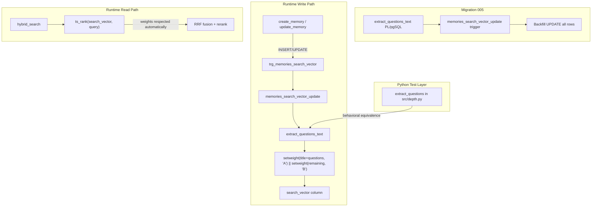

# Design Document: Question-Aware Search

## Overview

This feature modifies the PostgreSQL `search_vector` trigger on the `memories` table to assign tsvector weight labels to different content sections. Currently the trigger builds an unweighted tsvector from `title || content`. After this change:

- **Weight A**: title + extracted "Questions this answers:" text
- **Weight B**: remaining body content

The built-in `ts_rank` function already respects weight labels, so `hybrid_search` in `src/search.py` benefits automatically — no code changes to the search path, MCP server, or ingest pipeline.

The feature consists of four deliverables:
1. A PL/pgSQL `extract_questions_text()` function that splits content into questions text and remaining content
2. A replacement `memories_search_vector_update()` trigger that uses weighted `setweight()` calls
3. A migration (`005_question_weighted_search.sql`) containing both functions plus a backfill UPDATE
4. A Python `extract_questions` function in `src/depth.py` mirroring the PL/pgSQL parser for use in tests

## Architecture



The architecture is intentionally narrow: only the trigger function changes. The read path (`hybrid_search`, `rerank`), the write path (`create_memory`, `update_memory`, `ingest_content`), and the MCP server all remain untouched.

## Components and Interfaces

### 1. PL/pgSQL `extract_questions_text(content TEXT)`

**Location:** `migrations/005_question_weighted_search.sql`

**Signature:**
```sql
CREATE OR REPLACE FUNCTION extract_questions_text(content TEXT)
RETURNS TABLE(questions_text TEXT, remaining_content TEXT)
LANGUAGE plpgsql IMMUTABLE
```

**Behavior:**
- Splits `content` line-by-line
- Finds the first line matching `questions this answers:` (case-insensitive)
- Collects subsequent lines starting with `- ` or `* ` as question lines, stripping the list marker. Also handles inline queries after the colon on the header line itself (e.g., "Questions this answers: How do I X?"). Inline query text is added to `questions_text` and also remains in `remaining_content` (since the header line is kept in `remaining_content` per R1.7). This means inline query words appear in both outputs — Weight A dominates in `ts_rank`, so the duplication is harmless and simplifies the parser.
- Stops collecting when it hits an empty line or a line that doesn't start with `- ` or `* `
- Returns `(questions_text, remaining_content)` where `questions_text` is the joined question lines and `remaining_content` is everything else (the question lines removed; the header line is kept in `remaining_content` since its words like "Questions", "this", "answers" are harmless as Weight B lexemes)
- If no header is found, returns `('', content)`
- If content is NULL, returns `('', '')`

### 2. Replacement `memories_search_vector_update()` trigger

**Location:** `migrations/005_question_weighted_search.sql`

**Signature:**
```sql
CREATE OR REPLACE FUNCTION memories_search_vector_update() RETURNS trigger
LANGUAGE plpgsql
```

**Behavior:**
- Calls `extract_questions_text(NEW.content)` to get `(q_text, r_content)`
- Builds: `setweight(to_tsvector('english', coalesce(NEW.title,'') || ' ' || q_text), 'A') || setweight(to_tsvector('english', r_content), 'B')`
- Assigns result to `NEW.search_vector`
- Returns `NEW`
- Handles NULL title/content via COALESCE

The existing trigger binding (`trg_memories_search_vector BEFORE INSERT OR UPDATE OF title, content`) is unchanged — `CREATE OR REPLACE FUNCTION` replaces the function body while preserving the trigger binding.

### 3. Backfill UPDATE

**Location:** `migrations/005_question_weighted_search.sql`

**SQL:**
```sql
UPDATE memories m SET search_vector =
  setweight(to_tsvector('english', coalesce(m.title,'') || ' ' || q.questions_text), 'A')
  || setweight(to_tsvector('english', q.remaining_content), 'B')
FROM LATERAL extract_questions_text(coalesce(m.content,'')) AS q;
```

The `LATERAL` keyword ensures `extract_questions_text` is evaluated per-row against each memory's content. Without it, PostgreSQL would treat the function call as a single-evaluation cross join. The parser is called once per row (not twice).

### 4. Python `extract_questions(content: str) -> tuple[str, str]`

**Location:** `src/depth.py`

**Signature:**
```python
def extract_questions(content: str) -> tuple[str, str]:
    """Extract 'Questions this answers:' section from content.
    
    Returns (questions_text, remaining_content).
    """
```

**Behavior:** Mirrors the PL/pgSQL parser exactly:
- Case-insensitive header match
- Inline queries after the colon on the header line
- `- ` or `* ` list items, markers stripped
- Terminated by empty line or non-list content
- Header line kept in `remaining_content`
- Returns `('', content)` when no header found

This function lives alongside the existing `_QUESTIONS_RE` regex in `src/depth.py`. The existing `_extract_golden_queries` in `src/dream_cycle_db.py` has similar logic but returns a list of query strings — the new function returns `(questions_text, remaining_content)` for tsvector parity testing.

## Data Models

### Existing Schema (unchanged)

The `memories` table already has a `search_vector TSVECTOR` column with a GIN index. No new columns, indexes, or tables are added.

```sql
-- Existing column (no change)
search_vector TSVECTOR
```

### Search Vector Content Change

| Before | After |
|--------|-------|
| `to_tsvector('english', title \|\| ' ' \|\| content)` — all lexemes unweighted (default weight D) | `setweight(to_tsvector('english', title \|\| ' ' \|\| questions_text), 'A') \|\| setweight(to_tsvector('english', remaining_content), 'B')` |

The `ts_rank` function uses default weights `{0.1, 0.2, 0.4, 1.0}` for labels `{D, C, B, A}`, meaning Weight A lexemes contribute 10x more than the old default-D lexemes, and Weight B lexemes contribute 4x more. This is the mechanism by which question-matching queries get boosted.

**Tuning note:** The default 10x boost for Weight A is intentionally strong for the initial implementation. If it proves too aggressive in practice (questions dominating over highly relevant body content), `hybrid_search` can pass a custom weights array to `ts_rank` (e.g., `ts_rank('{0.1, 0.2, 0.4, 0.6}', search_vector, query)`) to dial it back. This would be a one-line change in `src/search.py`.

### Questions Section Format

The parser recognizes this content pattern:

```
Questions this answers:
- How do I configure the database?
- What is the connection string format?
* Why does the connection pool timeout?

Regular body content continues here...
```

The header line, bullet lines, and their markers are extracted. The remaining content is everything else.


## Correctness Properties

*A property is a characteristic or behavior that should hold true across all valid executions of a system — essentially, a formal statement about what the system should do. Properties serve as the bridge between human-readable specifications and machine-verifiable correctness guarantees.*

### Property 1: Round-trip word preservation

*For any* content string (with or without a "Questions this answers:" section), splitting it via the questions extractor into `(questions_text, remaining_content)` shall preserve all non-marker words: the set of words in `questions_text` ∪ `remaining_content` equals the set of words in the original content minus the list markers (`- `, `* `). The header line ("Questions this answers:") is kept in `remaining_content`, so its words are preserved.

**Validates: Requirements 1.8, 8.1**

### Property 2: List marker stripping

*For any* content string containing a "Questions this answers:" section with one or more bullet items, the `questions_text` output shall not contain any leading `- ` or `* ` list markers — every question line is returned with its marker stripped.

**Validates: Requirements 1.5, 6.3**

### Property 3: Cross-implementation equivalence

*For any* content string, the Python `extract_questions()` function and the PL/pgSQL `extract_questions_text()` function shall produce identical `(questions_text, remaining_content)` tuples.

**Validates: Requirements 6.2, 6.5**

### Property 4: Backfill–trigger consistency

*For any* memory row, the `search_vector` produced by the backfill UPDATE (which calls `extract_questions_text` inline) shall equal the `search_vector` produced by a fresh INSERT of the same `(title, content)` pair through the trigger.

**Validates: Requirements 5.2, 8.4**

## Error Handling

### NULL Content / Title

Both the PL/pgSQL parser and the trigger use `COALESCE` to handle NULL values:
- `extract_questions_text(NULL)` returns `('', '')`
- The trigger uses `coalesce(NEW.title, '')` and `coalesce(NEW.content, '')` before calling the parser
- The backfill uses `coalesce(title, '')` and `coalesce(content, '')` in the UPDATE

### Empty Questions Section

If the header line exists but is immediately followed by an empty line or non-list content, the parser returns an empty string for `questions_text`. The trigger then assigns weight A to the title only and weight B to the full content — equivalent to the no-questions-section case.

### Multiple Questions Sections

Only the first "Questions this answers:" header is processed. Subsequent headers are treated as regular body content and included in `remaining_content` with weight B.

### Migration Idempotency

All functions use `CREATE OR REPLACE FUNCTION`, making the migration safe to re-run. The backfill UPDATE is also idempotent — re-running it simply recomputes the same weighted tsvector values.

## Testing Strategy

### Property-Based Tests (Hypothesis)

Each correctness property maps to a single Hypothesis property test. Minimum 100 examples per test.

| Property | Test | Strategy |
|----------|------|----------|
| Property 1: Round-trip word preservation | Generate random content strings with/without questions sections. Split via `extract_questions()`. Verify word set equality. | `st.text` + custom strategy that injects questions sections |
| Property 2: List marker stripping | Generate content with questions sections containing `- ` and `* ` markers. Verify `questions_text` has no leading markers. | Custom strategy producing content with bullet lists |
| Property 3: Cross-implementation equivalence | Generate random content. Run both Python `extract_questions()` and PL/pgSQL `extract_questions_text()` (via test DB). Compare outputs. | `st.text` + test DB fixture |
| Property 4: Backfill–trigger consistency | Generate random `(title, content)` pairs. Insert via trigger, then run backfill SQL. Compare `search_vector` values. | Custom strategy + test DB fixture |

**Library:** Hypothesis (already in `requirements.txt`)

**Tagging format:** Each test docstring includes:
```
Feature: question-aware-search, Property {N}: {title}
```

### Unit / Integration Tests (pytest)

| Test | Type | Requires DB |
|------|------|-------------|
| Trigger populates weighted search_vector on INSERT | integration | yes |
| ts_rank scores questions-match higher than body-match | integration | yes |
| Backfill produces same search_vector as fresh INSERT | integration | yes |
| No questions section → weight A on title only | edge case | yes |
| Empty questions section (header, no bullets) | edge case | no (Python) + yes (DB) |
| Multiple questions headers (only first extracted) | edge case | no (Python) + yes (DB) |
| NULL content handling | edge case | yes |
| Migration is idempotent (apply twice, no errors) | integration | yes |

### Test Infrastructure

- The existing `test_db` session-scoped fixture in `tests/conftest.py` applies all migrations from `migrations/`. Since it uses `sorted(glob(...))`, the new `005_question_weighted_search.sql` will be picked up automatically — no changes to `conftest.py` needed.
- Property 3 (cross-implementation equivalence) and Property 4 (backfill–trigger consistency) require the test DB fixture since they exercise PL/pgSQL functions.
- Properties 1 and 2 can run without a database — they test the pure Python `extract_questions()` function only.
- All 243 existing tests must continue to pass. The trigger replacement is backward-compatible (it produces a tsvector with the same lexemes, just with weight labels added).
