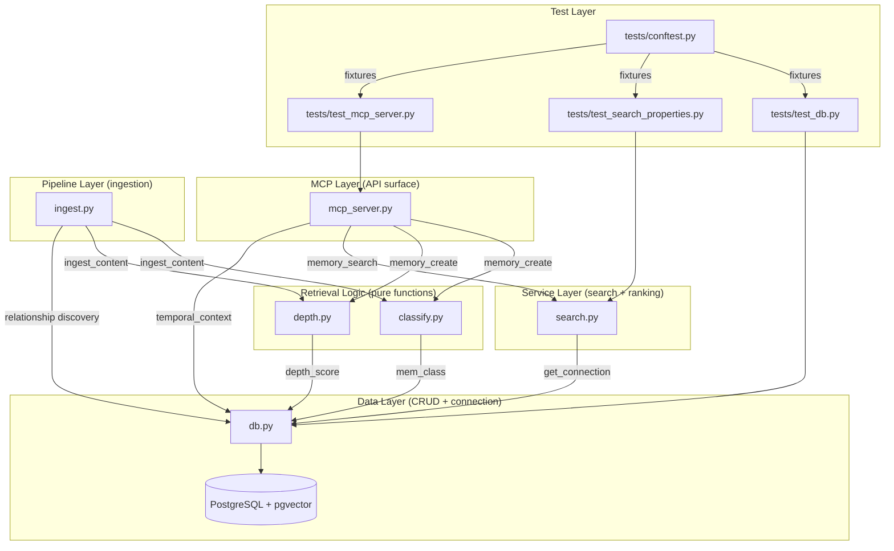
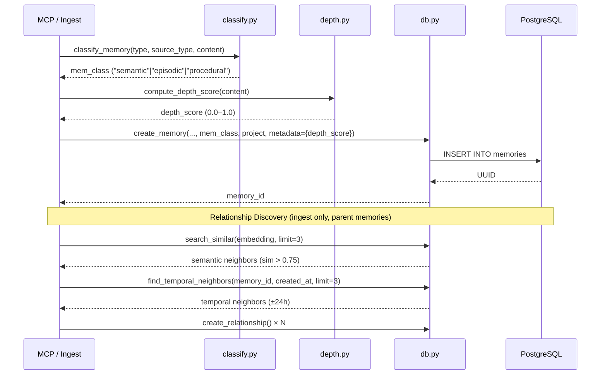
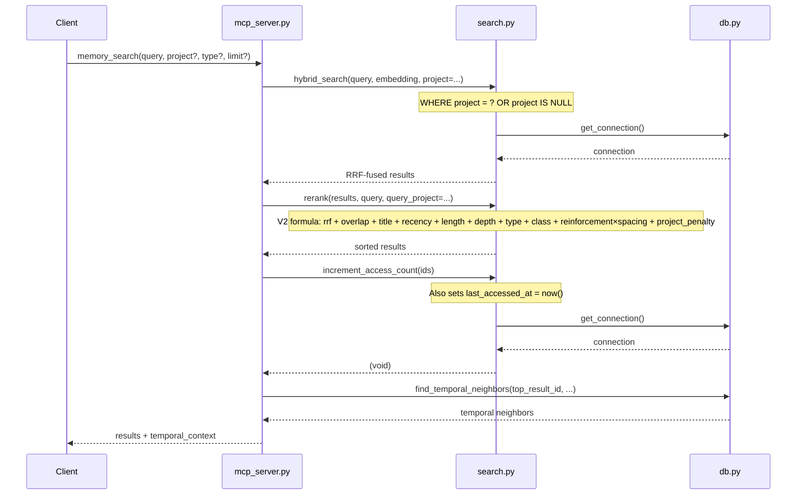

# Design Document: Retrieval Quality

## Overview

Retrieval Quality enhances the search and ranking pipeline of the Second Brain MCP server (PostgreSQL + pgvector). This is Layer 1 — passive improvements applied at ingest and retrieval time, complementary to the dream cycle pipeline (Layer 2 — active synthesis that produces new semantic memories).

The changes span nine requirements across six areas:

1. **Test infrastructure** — shared fixtures, embedding mocks, and baseline regression tests for `db.py`, `search.py`, and `mcp_server.py` (the three core modules this spec modifies).
2. **Schema migration** — three new columns (`mem_class`, `project`, `last_accessed_at`) added idempotently in a single migration.
3. **New pure-function modules** — `src/classify.py` (deterministic memory classifier) and `src/depth.py` (numeric depth scorer). These are standalone modules with no database dependencies, following the same separation pattern used in the dream cycle decomposition.
4. **Reranker & search upgrades** — spaced retrieval, classification boost, depth boost, project penalty, and updated base weights in `rerank()`; project filtering in `hybrid_search()`.
5. **Relationship discovery** — automatic semantic and temporal neighbor linking at ingest time.
6. **Temporal contiguity** — search results enriched with temporal context from the top result's neighbors.

### Separation of Concerns

The Second Brain codebase has three distinct concern areas:

| Layer | Concern | Modules | This Spec? |
|-------|---------|---------|------------|
| **Layer 1: Retrieval** | Search, ranking, classification, depth scoring | `search.py`, `db.py`, `classify.py`, `depth.py`, `mcp_server.py`, `ingest.py` | Yes |
| **Layer 2: Synthesis** | Active exploration, insight generation, consensus | `src/dream_cycle/` package, `dream_cycle_db.py` | No (separate spec) |
| **Infrastructure** | Embeddings, parsing, agent invocation | `embeddings.py`, `src/parsers/`, `agent_invoker.py` | No |

New modules (`classify.py`, `depth.py`) are pure functions with no database or network dependencies — they take strings in and return values out. This makes them independently testable with property-based tests and avoids coupling retrieval logic to the data layer.

Note: `rerank()`, `hybrid_search()`, and `increment_access_count()` have been extracted from `db.py` to `src/search.py` (see data-layer-decomposition spec). This spec modifies those functions in `search.py`. The data-access primitives (`search_similar`, `create_memory`, `get_connection`, etc.) remain in `db.py`.

All changes are additive. Existing 174 tests (157 dream-cycle + 17 data-layer-decomposition property tests) remain untouched. No external service calls are introduced in tests (Bedrock embeddings are mocked).

## Architecture



### Data Flow: Memory Creation (with Retrieval Quality)



### Data Flow: Memory Search (with Retrieval Quality)



## Components and Interfaces

### 1. `src/classify.py` — Memory Classifier (NEW, pure function)

```python
def classify_memory(type: str, source_type: str | None, content: str) -> str:
    """Deterministic classification of a memory.

    Rules (evaluated in order):
    1. If content contains procedural markers → "procedural"
    2. If type in SEMANTIC_TYPES → "semantic"
    3. If type == "source" → "episodic"
    4. Default → "episodic"

    Returns: "semantic" | "episodic" | "procedural"
    """
```

Constants:
- `SEMANTIC_TYPES = {"idea", "synthesis", "insight", "decision", "connection", "priority", "project", "question"}`
- `PROCEDURAL_MARKERS` — regex matching step-by-step instructions, "how to" phrases, numbered instruction lists

No database, network, or file system dependencies. Testable with pure property-based tests.

### 2. `src/depth.py` — Depth Scorer (NEW, pure function)

```python
def compute_depth_score(content: str) -> float:
    """Compute a numeric depth score in [0.0, 1.0].

    Signals detected:
    - Causal connectors: "because", "when...then", "which causes", "which leads",
      "which means", "so that", "the fix was", "this means"
    - Concrete examples: code blocks (```), specific numbers, named tools/libraries
    - "Questions this answers:" section
    - Content length (word count)
    - Connection phrases: "extends", "contradicts", "relates to"

    Each signal contributes a weighted sub-score. The total is clamped to [0.0, 1.0].
    """
```

Replaces the binary `_DEPTH_RE` regex currently in `mcp_server.py`. The regex moves to `depth.py` and `mcp_server.py` imports from there. No database, network, or file system dependencies.

### 3. `src/db.py` — Modified Functions

#### `create_memory()` — add `mem_class` and `project` parameters

```python
def create_memory(type, title, content, embedding=None, tags=None, source_url=None,
                   source_type=None, metadata=None, status="active", confidence=1.0,
                   parent_id=None, summary=None, mem_class=None, project=None):
    # INSERT now includes mem_class, project columns
```

#### `ALLOWED_UPDATE_FIELDS` — extend

```python
ALLOWED_UPDATE_FIELDS = {
    "title", "content", "summary", "embedding", "tags", "source_url",
    "source_type", "metadata", "status", "confidence", "type",
    "mem_class", "project", "last_accessed_at",  # Retrieval Quality
}
```

#### `find_temporal_neighbors()` — NEW

```python
def find_temporal_neighbors(memory_id: str, created_at, limit: int = 3) -> list[dict]:
    """Find memories created within ±24 hours of the given timestamp.

    Excludes the specified memory_id. Returns list of dicts with
    id, title, type, created_at fields.
    """
```

### 3b. `src/search.py` — Modified Functions

#### `increment_access_count()` — also set `last_accessed_at`

```python
def increment_access_count(memory_ids):
    # UPDATE memories SET access_count = access_count + 1,
    #   last_accessed_at = now() WHERE id = ANY(...)
```

#### `hybrid_search()` — add `project` parameter

```python
def hybrid_search(query_text, query_embedding, limit=10, type=None, status=None, project=None):
    # When project is provided:
    #   WHERE ... AND (project = %s OR project IS NULL)
```

#### `rerank()` — updated formula

```python
def rerank(results, query_text, query_project=None):
    # Updated formula per result:
    #   spacing_bonus = min(1.0, days_since_last_access / 7.0)  [default 1.0 if NULL]
    #   reinforcement = 0.03 * log1p(access_count) * spacing_bonus
    #   depth_score = metadata.get("depth_score", 0.0)
    #   mem_class_boost = {semantic: 0.04, procedural: 0.02, episodic/NULL: 0.00}
    #   project_penalty = -0.15 if (query_project and mem.project and mem.project != query_project) else 0.0
    #
    #   rerank_score = 0.30 * rrf_score
    #                + 0.18 * token_overlap
    #                + 0.18 * title_overlap
    #                + 0.12 * recency
    #                + 0.08 * length_score
    #                + 0.05 * depth_score
    #                + type_boost
    #                + mem_class_boost
    #                + reinforcement
    #                + project_penalty
```

### 4. `src/ingest.py` — Modified `ingest_content()`

```python
def ingest_content(content, source_type, source_url=None, project=None):
    # After storing parent memory:
    #   1. classify_memory() → mem_class
    #   2. compute_depth_score() → depth_score (stored in metadata)
    #   3. create_memory(..., mem_class=mem_class, project=project)
    #   4. For parent memories (not chunks):
    #      a. Find top-3 semantic neighbors (cosine sim > 0.75)
    #      b. Find top-3 temporal neighbors (±24h)
    #      c. Create related_to relationships for each
```

### 5. `src/mcp_server.py` — Modified Tools

#### `memory_create` — add `project` param, use classifier + depth scorer

```python
@mcp.tool()
def memory_create(type, title, content, tags=None, source_type=None,
                  source_url=None, metadata=None, project=None):
    # 1. classify_memory(type, source_type, content) → mem_class
    # 2. compute_depth_score(content) → depth_score
    # 3. Store depth_score in metadata
    # 4. create_memory(..., mem_class=mem_class, project=project)
    # 5. Depth warnings use numeric score instead of binary regex
```

#### `memory_search` — add `project` param, temporal context

```python
@mcp.tool()
def memory_search(query, type=None, limit=10, project=None):
    # 1. hybrid_search(..., project=project)
    # 2. rerank(results, query, query_project=project)
    # 3. increment_access_count(ids)
    # 4. find_temporal_neighbors(top_result) → temporal_context (max 3, deduplicated)
    # 5. Return results + temporal_context
```

### 6. Test Infrastructure

#### `tests/conftest.py` — Shared Fixtures

- `test_db` (session-scoped) — creates `memory_bank_test` database, applies all migrations, overrides `db.DB_CONFIG`
- `clean_tables` (function-scoped) — truncates `memories` and `memory_relationships` between tests
- `mock_embedding` — returns deterministic 1024-dim vector (e.g., normalized hash of input text)
- `sample_memory_factory` — factory fixture creating memories with known content

#### `tests/test_db.py` — Baseline DB Tests

- `create_memory` returns valid UUID
- `search_similar` returns results for a known embedding
- `create_relationship` persists a retrievable relationship
- `find_temporal_neighbors` returns neighbors within ±24h

Note: Search and ranking tests (`hybrid_search`, `rerank`, `increment_access_count`) are in `tests/test_search_properties.py` (17 existing property tests from data-layer-decomposition) and `tests/test_rerank.py` (V2 formula tests).

#### `tests/test_mcp_server.py` — MCP Smoke Tests

- `memory_create` returns an ID string
- `memory_search` returns a list
- `memory_create` emits depth warning for shallow content

### 7. Migration

```sql
-- Idempotent retrieval quality schema additions
ALTER TABLE memories ADD COLUMN IF NOT EXISTS mem_class TEXT;
ALTER TABLE memories ADD COLUMN IF NOT EXISTS project TEXT;
ALTER TABLE memories ADD COLUMN IF NOT EXISTS last_accessed_at TIMESTAMPTZ;

CREATE INDEX IF NOT EXISTS idx_memories_mem_class ON memories (mem_class);
CREATE INDEX IF NOT EXISTS idx_memories_project ON memories (project);
CREATE INDEX IF NOT EXISTS idx_memories_last_accessed_at ON memories (last_accessed_at DESC);
```

## Data Models

### Memory Row (Retrieval Quality additions highlighted)

| Column | Type | Default | Notes |
|--------|------|---------|-------|
| id | UUID | gen_random_uuid() | PK |
| type | TEXT | NOT NULL | idea, synthesis, source, etc. |
| title | TEXT | NOT NULL | |
| content | TEXT | NOT NULL | |
| summary | TEXT | NULL | |
| embedding | vector(1024) | NULL | Titan v2 embedding |
| tags | TEXT[] | '{}' | |
| source_url | TEXT | NULL | |
| source_type | TEXT | NULL | |
| metadata | JSONB | '{}' | **Now includes `depth_score`** |
| status | TEXT | 'active' | |
| confidence | FLOAT | 1.0 | |
| parent_id | UUID | NULL | FK → memories.id |
| created_at | TIMESTAMPTZ | now() | |
| updated_at | TIMESTAMPTZ | now() | |
| search_vector | TSVECTOR | auto-trigger | |
| access_count | INTEGER | 0 | |
| **mem_class** | **TEXT** | **NULL** | **NEW: semantic / episodic / procedural** |
| **project** | **TEXT** | **NULL** | **NEW: project tag for scoping** |
| **last_accessed_at** | **TIMESTAMPTZ** | **NULL** | **NEW: for spacing bonus** |

### Classification Rules

| Priority | Condition | Result |
|----------|-----------|--------|
| 1 (highest) | Content matches procedural markers | `procedural` |
| 2 | type ∈ {idea, synthesis, insight, decision, connection, priority, project, question} | `semantic` |
| 3 | type = "source" | `episodic` |
| 4 (default) | None of the above | `episodic` |

### Rerank Score Components

| Component | Weight/Value | Source |
|-----------|-------------|--------|
| rrf_score | × 0.30 | hybrid_search RRF fusion |
| token_overlap | × 0.18 | query tokens ∩ content+title tokens |
| title_overlap | × 0.18 | query tokens ∩ title tokens |
| recency | × 0.12 | exp(-days_old / 60) |
| length_score | × 0.08 | min(1.0, word_count / 80) |
| depth_score | × 0.05 | metadata.depth_score ∈ [0,1] |
| type_boost | +0.06 | idea/synthesis/insight/decision |
| mem_class_boost | +0.04/+0.02/+0.00 | semantic/procedural/episodic |
| reinforcement | +0.03 × log1p(access) × spacing | spacing = min(1, days/7) |
| project_penalty | −0.15 | cross-project mismatch |

### Spacing Bonus Formula

```
days_since = (now - last_accessed_at).total_seconds() / 86400
spacing_bonus = min(1.0, days_since / 7.0)

Special cases:
  last_accessed_at is NULL → spacing_bonus = 1.0
  last_accessed_at is today → spacing_bonus = 0.0
  last_accessed_at ≥ 7 days ago → spacing_bonus = 1.0
```

### Relationship Discovery Limits

| Neighbor Type | Threshold | Max Per Memory |
|---------------|-----------|----------------|
| Semantic | cosine similarity > 0.75 | 3 |
| Temporal | created within ±24 hours | 3 |


## Correctness Properties

### Property 1: Embedding Mock Determinism

*For any* input string, the Embedding_Mock fixture shall return a 1024-dimensional list of floats, and calling it twice with the same input shall produce the same output.

**Validates: Requirements 1.3**

### Property 2: create_memory V2 Fields Round Trip

*For any* valid `mem_class` value in {"semantic", "episodic", "procedural"} and *for any* non-empty `project` string, calling `create_memory()` with those parameters and then `get_memory()` on the returned ID shall yield a row where `mem_class` and `project` match the inputs.

**Validates: Requirements 2.5**

### Property 3: Spacing Bonus Formula

*For any* non-negative float `days_since_last_access`, the spacing bonus shall equal `min(1.0, days_since_last_access / 7.0)`. When `last_accessed_at` is NULL, the spacing bonus shall be 1.0. This implies: 0 days → 0.0, 3.5 days → 0.5, 7+ days → 1.0.

**Validates: Requirements 3.2, 3.3, 3.4, 3.5**

### Property 4: Classifier Correctness

*For any* memory type, source_type, and content string, `classify_memory()` shall return the correct classification according to the priority rules: (1) content with procedural markers → "procedural" regardless of type, (2) type in SEMANTIC_TYPES → "semantic", (3) type = "source" → "episodic", (4) default → "episodic".

**Validates: Requirements 4.1, 4.2, 4.3, 4.4**

### Property 5: Depth Score Range Invariant

*For any* string input (including empty string, whitespace, unicode, very long text), `compute_depth_score()` shall return a float in the closed interval [0.0, 1.0].

**Validates: Requirements 5.1**

### Property 6: Rich Content Produces High Depth Score

*For any* content string that contains at least 2 causal connectors, at least 1 code block, and a "Questions this answers:" section, `compute_depth_score()` shall return a value greater than 0.7.

**Validates: Requirements 5.3**

### Property 7: Shallow Content Produces Low Depth Score

*For any* content string that is a single short sentence (under 50 characters) with no causal connectors, no code blocks, and no "Questions this answers:" section, `compute_depth_score()` shall return a value less than 0.3.

**Validates: Requirements 5.4**

### Property 8: Complete Rerank Formula

*For any* memory result with known values for rrf_score, token_overlap, title_overlap, recency, length_score, depth_score, type, mem_class, access_count, last_accessed_at, project, and a given query_project, the rerank_score shall equal:

`0.30 * rrf_score + 0.18 * token_overlap + 0.18 * title_overlap + 0.12 * recency + 0.08 * length_score + 0.05 * depth_score + type_boost + mem_class_boost + 0.03 * log1p(access_count) * spacing_bonus + project_penalty`

where type_boost, mem_class_boost, spacing_bonus, and project_penalty are computed per their respective rules.

**Validates: Requirements 7.1–7.7, 3.6, 4.7–4.9, 5.7, 6.5–6.7**

### Property 9: Spacing Bonus Ordering

*For any* two memories that are identical in all reranking components but differ only in `last_accessed_at`, the memory with the higher spacing bonus (older last access) shall receive a higher rerank score.

**Validates: Requirements 3.7**

### Property 10: Classification Ordering

*For any* two memories that are identical in all reranking components except `mem_class`, where one has `mem_class = "semantic"` and the other has `mem_class = "episodic"`, the semantic memory shall receive a higher rerank score.

**Validates: Requirements 4.10**

### Property 11: hybrid_search Project Filtering

*For any* project value passed to `hybrid_search()`, all returned results shall have either a `project` matching the query project or a NULL `project`. No result shall have a non-NULL `project` that differs from the query project.

**Validates: Requirements 6.4**

### Property 12: Relationship Discovery Caps

*For any* newly ingested parent memory, the relationship discovery process shall create at most 3 semantic relationships and at most 3 temporal relationships (6 total maximum).

**Validates: Requirements 8.5**

### Property 13: Chunks Skip Relationship Discovery

*For any* memory with a non-NULL `parent_id` (a chunk), the ingest pipeline shall not perform relationship discovery — no semantic or temporal neighbor searches, and no `related_to` relationships created.

**Validates: Requirements 8.6**

### Property 14: find_temporal_neighbors Correctness

*For any* memory ID and timestamp, `find_temporal_neighbors()` shall return only memories whose `created_at` is within ±24 hours of the given timestamp, and shall never include the specified memory_id in the results.

**Validates: Requirements 8.7**

### Property 15: Temporal Context Invariants

*For any* `memory_search` response containing a `temporal_context` list: (a) each entry shall contain `id`, `title`, `type`, `created_at`, and `relation` = "temporal_neighbor", (b) the list shall contain at most 3 entries, and (c) no entry's `id` shall match any `id` in the main search results.

**Validates: Requirements 9.2, 9.3, 9.4**

### Property 16: increment_access_count Updates last_accessed_at

*For any* non-empty list of memory IDs, after calling `increment_access_count()`, each memory's `last_accessed_at` shall be non-NULL and within a few seconds of the current UTC time.

**Validates: Requirements 3.1**

## Error Handling

| Scenario | Handling |
|----------|----------|
| `classify_memory()` receives unknown type | Returns "episodic" (default rule) |
| `compute_depth_score()` receives empty string | Returns 0.0 (no signals detected) |
| `compute_depth_score()` receives very long content | Truncates analysis to first 10,000 characters to bound computation |
| `metadata` JSONB missing `depth_score` key | Reranker treats as 0.0 |
| `last_accessed_at` is NULL | Spacing bonus defaults to 1.0 |
| `hybrid_search()` with `project` but no matching memories | Returns memories with NULL project (universal knowledge) |
| `find_temporal_neighbors()` finds no neighbors | Returns empty list; no relationships created |
| Semantic neighbor search returns fewer than 3 results | Creates relationships only for those found |
| `create_relationship()` fails (duplicate key) | Silently skip — relationship already exists |
| Migration re-run on already-migrated database | No-op due to `IF NOT EXISTS` guards |
| `memory_search` top result has no temporal neighbors | `temporal_context` is an empty list |

## Testing Strategy

### Dual Testing Approach

The test suite uses both unit tests and property-based tests:

- **Unit tests** — specific examples, integration smoke tests, edge cases, error conditions
- **Property-based tests** — universal properties verified across 100+ generated inputs using Hypothesis

### Property-Based Testing Configuration

- **Library**: [Hypothesis](https://hypothesis.readthedocs.io/) (already in use for dream-cycle tests)
- **Minimum iterations**: 100 per property test (`@settings(max_examples=100)`)
- **Tag format**: Each property test includes a docstring comment: `Feature: retrieval-quality, Property {N}: {title}`
- **Each correctness property maps to exactly one `@given`-decorated test function**

### Test File Organization

| File | Scope | Type |
|------|-------|------|
| `tests/conftest.py` | Shared fixtures (test_db, mock_embedding, sample_memory_factory) | Fixtures |
| `tests/test_db.py` | Baseline db.py CRUD tests + db.py property tests | Unit + Property |
| `tests/test_search_properties.py` | Existing search/rerank property tests (17 tests from data-layer-decomposition) | Property |
| `tests/test_mcp_server.py` | MCP smoke tests + temporal context property tests | Unit + Property |
| `tests/test_classify.py` | Classifier correctness (Property 4) | Property |
| `tests/test_depth.py` | Depth scorer properties (Properties 5, 6, 7) | Property |
| `tests/test_rerank.py` | Rerank formula + ordering properties (Properties 8, 9, 10) | Property |
| `tests/test_ingest_v2.py` | Relationship discovery properties (Properties 12, 13) | Property + Unit |

### Property Test Coverage

Each correctness property (1–16) maps to one `@given`-decorated Hypothesis test. Key strategies:

- **Classifier (P4)**: Generate random (type, content) pairs; independently compute expected class; assert match
- **Depth scorer (P5–P7)**: Generate arbitrary strings for P5; generate strings with injected signals for P6; generate short signal-free strings for P7
- **Rerank formula (P8)**: Generate random component values in valid ranges; compute expected score independently; assert match within float tolerance
- **Ordering (P9, P10)**: Generate pairs of memories differing in one dimension; assert correct ordering
- **Project filtering (P11)**: Requires test_db; insert memories with various projects; query with a specific project; assert all results match or are NULL
- **Temporal neighbors (P14)**: Requires test_db; insert memories at various timestamps; query; assert all within ±24h window
- **Temporal context (P15)**: Mock search results and temporal neighbors; assert field presence, max count, and deduplication
