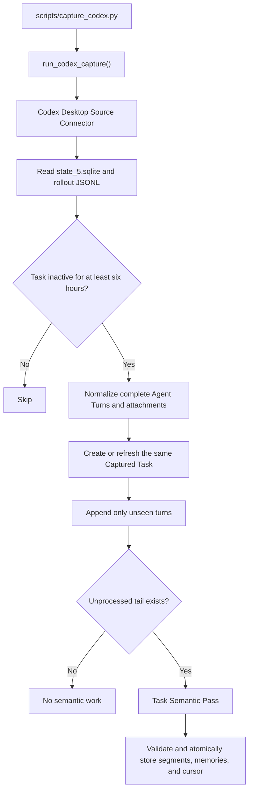

# Capture Component

> **Status: canonical component contract.** Last reviewed: 2026-07-23.

Capture reaches external sources, decides what is eligible, preserves
source-native identity and provenance, and normalizes material for durable
storage.

## Boundary

Capture owns:

- source discovery and read access;
- Task Ownership classification from source-native evidence;
- source-specific eligibility, such as the Codex six-hour inactivity rule;
- stable, integration-namespaced source identity;
- exclusion of unsupported or private event classes;
- normalization into documents or complete Agent Turns; and
- source-specific refresh and backfill behavior.

Capture does not own:

- general search and reranking;
- Dream Cycle consensus;
- Express delivery;
- model-provider mechanics; or
- the meaning of a semantic project inferred from source workspace metadata.

The current physical implementation is transitional. Generic document sources
normally call `ingest_content`, while Codex Task Capture coordinates its
source read, durable source write, Task Semantic Pass, and semantic write from
one module. The logical storage responsibility belongs to
[Ingestion & Storage](ingestion-storage.md), even where the code has not yet
been separated.

## Contract

| Input | Output |
|---|---|
| Source-native items, timestamps, content, and metadata | Stable source identity and normalized evidence |
| Agent Task history | Ordered complete Agent Turns with one user prompt and one visible outcome |
| Attachments | Attachment Descriptors retained with their Agent Turn |
| A later source revision | The same Captured Task with unseen complete turns appended |

Agentic-assistant connectors classify every discovered task as `user-owned`,
`delegated`, or `unknown` before eligibility. Only User-Owned Tasks continue.
Delegated Tasks and Unknown-Ownership Tasks are skipped and reported. Connectors
also exclude system and developer instructions, hidden reasoning, tool calls and
results, delegated-agent activity within the retained task, and progress
commentary.

## Task Ownership contract

The three ownership outcomes and their behavior are shared across every
agentic-assistant integration:

| Classification | Meaning | Capture behavior |
|---|---|---|
| `user-owned` | Native evidence identifies the task as the user's conversation | Continue to source-specific eligibility |
| `delegated` | Native evidence identifies child or subagent work created inside another task | Skip independent capture and report the count |
| `unknown` | Available evidence cannot safely establish either classification | Skip independent capture and report the count |

Delegation evidence wins if native fields conflict. Transcript wording may
support a connector-specific fallback, but it is not preferred over structured
parentage or ownership metadata.

### Connector evidence

| Integration | User-owned evidence | Delegated evidence | Readiness |
|---|---|---|---|
| Codex Desktop | `thread_source = 'user'` | `thread_source = 'subagent'`, a child entry in `thread_spawn_edges`, non-empty `agent_path`, or structured `source.subagent` metadata | Reference mapping implemented and tested |
| Kiro CLI and IDE | Must be established from native session metadata during standardization | The existing Dream Cycle and `--no-interactive` content heuristic is only a fallback candidate | Not ready for the shared standard |
| Claude Code | Must be established from native session metadata during connector work | Parent/subagent metadata must be identified and fixture-tested | Not ready for the shared standard |
| Quick Desktop | Must be established from its local session store | Native delegation evidence must be identified and fixture-tested | Not ready for the shared standard |
| Amazon Quick | Must be established from the web session source | Native delegation evidence must be identified and fixture-tested | Future connector |
| Amazon Q Developer | Must be established from its own session source | Native delegation evidence must be identified and fixture-tested | Future connector |

An integration does not become active under the Agent Task standard while its
ownership evidence remains unspecified.

## Codex automated run

The source capture commits before semantic processing. If the model call,
validation, embedding, or semantic write fails, the Captured Task remains
stored, partial semantic output is discarded, and the unchanged Semantic
Processing Cursor causes a later invocation to retry the full tail.

A resumed Codex Task remains the same source task. After another six hours of
inactivity, a later run appends only unseen complete turns. Changed, missing,
or reordered known turns are Source Drift and do not rewrite stored evidence.

## Entry points

| Purpose | Entry point |
|---|---|
| Codex command | `scripts/capture_codex.py` |
| Codex capture interface | `src/capture/codex.py::run_codex_capture` |
| Codex source reader | `src/capture/sources/codex.py::CodexDesktopSource` |
| Agent Task value objects | `src/capture/agent_tasks.py` |
| YouTube capture | `src/capture/youtube.py` |
| Generic ingestion handoff | `src/ingest.py::ingest_content` |

## Source status

| Source | Current state |
|---|---|
| Codex Desktop | Reference Agent Task implementation; bounded live proof complete; scheduling and full backfill disabled |
| YouTube | In-repository connector |
| Quick Desktop | Working integration through several existing scripts; not yet consolidated |
| Kiro CLI and IDE | Existing extraction and ingestion scripts; not yet migrated to the Codex Agent Task standard |
| Amazon Quick | Future, separate web connector |
| Amazon Q Developer | Future, separate connector |
| Claude Code | Existing historical ingestion differs from the Codex Task path; standardization deferred until Codex is proven in operation |

## Tests and verification

Every agentic-assistant connector must pass the same behavioral contract:

- User-Owned Tasks continue to eligibility and capture;
- Delegated Tasks are excluded as independent sources;
- Unknown-Ownership Tasks are conservatively skipped;
- skipped ownership classifications are visible in run reporting;
- only user prompts and visible final outcomes become Agent Turns;
- source identity is stable and integration-namespaced;
- Task Refresh is monotonic and preserves Exact Provenance; and
- source-specific native record fixtures exercise the connector's ownership
  evidence rather than only an already-normalized representation.

These are shared behavioral obligations, not yet a shared runtime test base.
Codex proves the first implementation. Common test helpers or runtime modules
should be extracted only when the second connector demonstrates the real seam.

- `tests/test_codex_capture.py`
- `tests/test_capture_codex_cli.py`
- `tests/test_agent_task_schema.py`
- `tests/test_capture_youtube.py`
- `tests/test_ingest_interactions.py`
- `docs/CORRECTION-EPISODE-BUILD1-CALIBRATION.md`

## Operations

Codex capture is write-capable but approval-gated. Dry runs and task-bounded
proofs use the same command as future automation. Do not install a Codex
LaunchAgent or run an unrestricted `--backfill` without explicit approval.

## Related

- [Architecture Component Index](index.md)
- [Capture component architecture](../CAPTURE-COMPONENTS.md)
- [Codex Task Capture build plan](../CODEX-TASK-CAPTURE-BUILD-PLAN.md)
- [Codex operations](../OPERATIONS.md#codex-desktop-task-capture--proof-gate-mode)
- [ADR 0002: Standardize Agent Task capture](../adr/0002-standardize-agent-task-capture.md)
- [ADR 0003: Monotonic capture](../adr/0003-accumulate-captured-task-history-monotonically.md)
- [ADR 0004: Source provenance and semantic project](../adr/0004-separate-source-provenance-from-semantic-project.md)
- [ADR 0006: Combined Task Semantic Pass](../adr/0006-combine-task-segmentation-and-distillation.md)
- [ADR 0007: Correction Episodes before steering](../adr/0007-capture-correction-episodes-before-steering.md)
- [ADR 0008: Task Ownership classification](../adr/0008-classify-task-ownership-before-capture.md)
