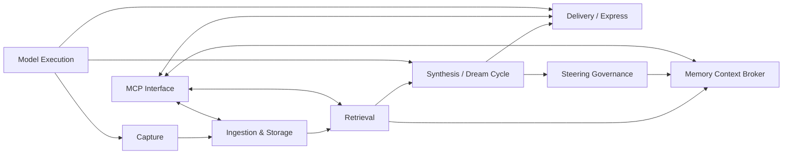

# Architecture Component Index

> **Status: canonical navigation.** Last reviewed: 2026-08-29.

Use this index to find the contract, runtime flow, implementation entry points,
tests, operations, and decisions for every major Second Brain component.

## How to read these documents

The component pages describe current responsibilities and boundaries. They also
state when the physical code has not yet reached the intended boundary.

- **Component pages** define what each component owns and how it interacts with
  the rest of the system.
- **Architecture Decision Records (ADRs)** explain why durable choices were
  made.
- **Build plans** describe scoped implementation work and may contain completed
  and deferred phases.
- **Operations guides** explain how to run and monitor the implemented system.
- **Verification records** preserve environment-specific proof.

When documents disagree, prefer the component contract for ownership, the
database schema for persisted structure, and the operations guide for activation
status.

## Component map



The arrows show primary data and invocation direction, not deployment
boundaries. PostgreSQL is the shared persistence contract. The MCP Interface and
Model Execution components are cross-cutting adapters rather than lifecycle
stages.

## Component registry

| Component | Owns | Primary contract | Status | Canonical page |
|---|---|---|---|---|
| Capture | Source access, eligibility, source identity, and normalization | Source-native content becomes normalized evidence | Implemented unevenly by source; Codex Task Capture is proven but not scheduled | [Capture](capture.md) |
| Ingestion & Storage | Classification, chunking, embeddings, transactional persistence, and relationships | Normalized evidence becomes durable memories and relationships | Implemented; write paths are not yet fully unified | [Ingestion & Storage](ingestion-storage.md) |
| Retrieval | Hybrid search, rank fusion, utility reranking, and retrieval reinforcement | Query plus filters returns ranked memories | Implemented and cohesive | [Retrieval](retrieval.md) |
| Synthesis | Explorer, Thinker, evaluator panel, consensus, and accepted-memory storage | Retrieved slices become consensus-gated insights | Implemented and scheduled | [Synthesis](synthesis.md) |
| Delivery | Briefing composition, editing, feedback, rendering, and gated push | Stored results become user-facing briefings | Implemented; proactive email remains configuration-gated | [Delivery](delivery.md) |
| Memory Context Broker | Authority, applicability, token packing, conflicts, and recall outcomes | `build_context` and `record_context_outcome` | Codex-first vertical slice implemented and proven | [Memory Context Broker](context-broker.md) |
| Steering Governance | Candidate evaluation, approval, versioning, and reviewed publication | Inactive candidate → approved rule → digest-guarded AGENTS publication | Codex-first vertical slice implemented and proven | [Steering Governance](steering-governance.md) |
| MCP Interface | Agent-facing memory, retrieval, context, outcome, learning, and briefing tools | Eleven stdio MCP tools | Implemented; one direct storage path remains | [MCP Interface](mcp-interface.md) |
| Model Execution | Role-to-backend resolution, model invocation, tool attachment, structured output, and usage telemetry | One `Invoker` contract across supported backends | Kiro, Claude Code, and Codex implemented; direct Bedrock deferred | [Model Execution](model-execution.md) |

## Common runtime paths

### Automated source capture

```text
scheduled command
  → Capture reads and normalizes eligible source material
  → Ingestion & Storage persists source evidence
  → source-specific semantic processing may derive searchable memories
  → a later Synthesis run can discover higher-order connections
  → Delivery may surface accepted results
```

Scheduling is source-specific. Codex Task Capture follows this path but its
hourly LaunchAgent and unrestricted historical backfill are not activated.

### Interactive agent request

```text
agent
  → MCP Interface
  → Ingestion & Storage, Retrieval, Memory Context Broker, or Delivery
  → structured MCP result
```

### Governed recall

```text
Correction Episodes or explicit durable direction
  → Steering Governance panel and user approval
  → active versioned Steering Rule
  → Memory Context Broker context pack and receipt
  → later Agent Task
  → followed/corrected/not_used/unknown outcome
```

### Dream Cycle

```text
scheduled Dream Cycle
  → Retrieval assembles evidence
  → Model Execution runs Explorer, Thinker, and evaluators
  → Synthesis accepts only consensus-gated candidates
  → Ingestion & Storage persists accepted memories
  → Delivery evaluates them on its own path
```

## Component page standard

Every component page records:

1. purpose and explicit boundary;
2. inputs, outputs, and public contract;
3. normal runtime flow;
4. failure and retry behavior;
5. code and command entry points;
6. owned or used persisted data;
7. focused tests and verification;
8. activation status; and
9. related ADRs, plans, and runbooks.

## Related

- [System architecture](../ARCHITECTURE.md)
- [Project charter](../PROJECT-CHARTER.md)
- [Architecture decisions](../adr/index.md)
- [Componentization roadmap](../COMPONENTIZATION-PLAN.md)
- [Capture component architecture](../CAPTURE-COMPONENTS.md)
- [Operations](../OPERATIONS.md)
- [Database schema](../user-guide/database-schema.md)
- [Glossary](../user-guide/glossary.md)
