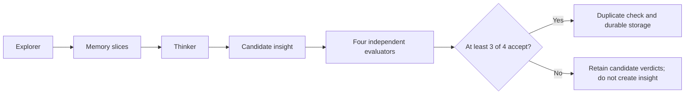

# Synthesis Component

> **Status: canonical component contract.** Last reviewed: 2026-07-23.

Synthesis runs the Dream Cycle: it retrieves evidence, proposes higher-order
insights, evaluates them independently, and persists only consensus-gated
results.

## Boundary

Synthesis owns:

- Explorer memory-slice construction;
- Thinker candidate generation;
- independent Skeptic, User Advocate, Epistemologist, and Methodologist votes;
- three-of-four acceptance consensus;
- duplicate checking and accepted candidate storage;
- Dream Cycle run and candidate state; and
- feedback and digest context used by later cycles.

It does not own source capture, ordinary Task Distillation, search algorithms,
model-provider subprocess details, or Express delivery.

Task Distillation and the Dream Cycle are intentionally different. Task
Distillation may derive a decision, insight, or Correction Episode directly
from one Captured Task. The Dream Cycle performs later evaluator-gated
synthesis across memories.

## Contract

Inputs:

- retrieved memory slices;
- prior feedback, rejections, dissents, and run context;
- configured role-to-backend assignments; and
- Dream Cycle prompts.

Outputs:

- stored run and candidate records;
- accepted insight memories and provenance relationships;
- rejected or deferred candidate evidence; and
- a run digest and metrics.

## Runtime flow

The Model Execution component resolves each role to its configured backend,
model, and effort. Backend failure is an infrastructure failure, not an
evaluator rejection.

## Failure behavior

The command records Dream Cycle run state and exits nonzero when orchestration
fails. Backend adapters map timeouts and nonzero subprocess exits to shared
exceptions so a crashed evaluator cannot become a fabricated rejection.

Accepted candidates pass through duplicate detection before storage. The
Dream Cycle may discover contradictions, but Codex Task Capture does not run a
separate immediate contradiction planner.

Correction Episodes are available as evidence to the Dream Cycle. Build 1
does not automatically promote them into Steering Rules or automatic context.

## Entry points

| Purpose | Entry point |
|---|---|
| Scheduled command | `scripts/dream_cycle_run.py` |
| Orchestration | `src/dream_cycle/orchestrator.py::DreamCycleOrchestrator` |
| Consensus | `src/dream_cycle/consensus.py::tally_consensus` |
| Accepted storage and duplicate checking | `src/dream_cycle/storage.py` |
| Run and candidate persistence | `src/dream_cycle_db.py` |
| Prompts | `src/prompts/` |
| Scheduled wrapper | `scripts/jobs/dream_cycle_scheduled.sh` |

## Tests

- `tests/test_dream_cycle.py`
- `tests/test_dream_cycle_db.py`
- `tests/test_dream_cycle_run.py`
- `tests/test_consensus.py`
- `tests/test_orchestrator_properties.py`
- `tests/test_panel_prompts.py`
- `tests/test_prompt_contracts.py`
- `tests/test_feedback_properties.py`

## Operations

The Dream Cycle has its own launchd schedule. It is separate from source
capture schedules and from Express delivery decisions, even when an Express
push runs after a completed cycle.

## Related

- [Architecture Component Index](index.md)
- [Dream Cycle design](../user-guide/dream-cycle-design.md)
- [Dream Cycle architecture](../ARCHITECTURE.md#dream-cycle-pipeline)
- [Model Execution](model-execution.md)
- [Operations](../OPERATIONS.md#scheduled-jobs)
- [Design decisions](../DESIGN-DECISIONS.md#why-the-dream-cycle-uses-a-four-agent-pipeline)
