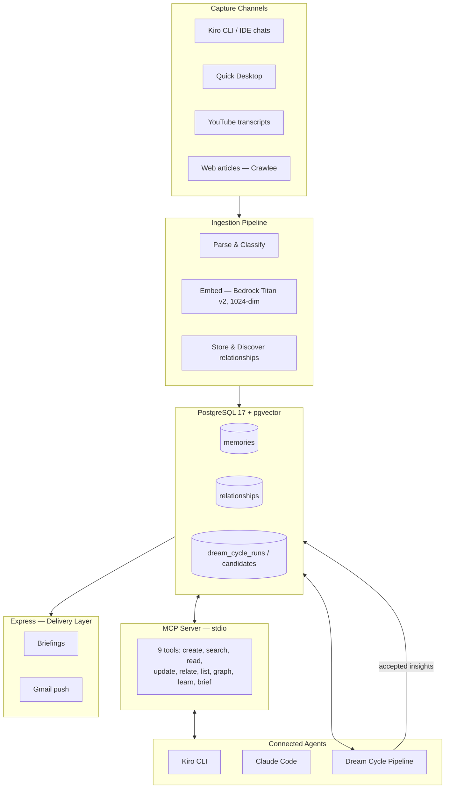

# System Architecture

How Second Brain's components fit together and why the system is shaped the way it is.

This page gives you a breadth-first understanding of the whole system — the five-stage data flow, the major components, and the cross-cutting design choices that bind them. For deeper dives into individual subsystems, follow the links to sibling pages.

## The five-stage data flow

Every piece of knowledge moves through five stages:

```
Capture → Ingest → Retrieve → Synthesize → Deliver
```

1. **Capture** — Content enters the system from multiple channels (Kiro CLI chats, Kiro IDE sessions, Quick Desktop documents, YouTube transcripts, web articles).
2. **Ingest** — A pipeline parses, classifies, chunks, embeds, and stores the content with auto-discovered relationships.
3. **Retrieve** — Hybrid search (BM25 full-text + vector cosine, fused with Reciprocal Rank Fusion) finds relevant memories, then a cognitive-science reranker scores them.
4. **Synthesize** — The *dream cycle* autonomously replays memories, finds hidden connections, and proposes new insights through a multi-agent consensus pipeline.
5. **Deliver** — *Express* surfaces synthesised output to you: on-demand briefings, gated email pushes, and the `memory_brief` MCP tool.

## Component diagram



## Major components

### Capture channels

You feed content into Second Brain through several channels. Each channel has its own connector, but all produce the same intermediate contract: a markdown file with a metadata header. This decouples acquisition from ingestion — if a connector changes (or you add a new one), the pipeline doesn't break.

| Channel | Connector | Notes |
|---------|-----------|-------|
| Kiro CLI / IDE chats | Chat parsers (`src/parsers/`) | Agents call `memory_create` directly or chats are batch-extracted |
| Quick Desktop | QD sync scripts | Documents, chats, feed events from `knowledge_v1.db` |
| YouTube | `src/capture/youtube.py` (yt-dlp) | Transcript extraction, in-repo |
| Web articles | Crawlee (Node.js, external) | Outputs markdown to a watched directory |

### Ingestion pipeline

The pipeline (`src/ingest.py`) transforms raw content into searchable, classified memories:

1. **Parse** — Extract text and metadata from the source format.
2. **Classify** — Assign a *mem_class* (semantic, episodic, or procedural) following Tulving's memory taxonomy.
3. **Chunk** — Split large content into coherent pieces.
4. **Embed** — Generate a 1024-dimensional vector via Amazon Bedrock (Titan v2).
5. **Store** — Write to PostgreSQL with auto-populated `search_vector` (tsvector trigger).
6. **Discover relationships** — Identify typed edges (`supports`, `extends`, `derived_from`, etc.) to existing memories.

### PostgreSQL + pgvector store

A single PostgreSQL 17 instance (native, localhost-only on port 5432) holds everything: memories, relationships, dream cycle state, and indexes. See [Database schema](database-schema.md) for the full table definitions.

Key indexes powering retrieval:

- **HNSW** on the `embedding` column (vector cosine similarity)
- **GIN** on `search_vector` (BM25 full-text)
- **GIN** on `tags` and `metadata` (JSONB filtering)

### MCP server

The MCP server (`src/mcp_server.py`) exposes nine tools over **stdio** — it opens no network port. Agents connect via the Model Context Protocol, issue tool calls, and receive structured responses. The server is the single entry point for all agent interactions with the knowledge store.

### Dream cycle

The *dream cycle* is an autonomous synthesis pipeline that runs on a schedule (launchd) and mirrors the brain's sleep consolidation process. It has three stages:

1. **Explorer** — Assembles "memory slices" using 11 strategies (temporal juxtaposition, cross-project collision, orphan archaeology, and others).
2. **Thinker** — Analyses slices and proposes candidate insights (CREATE, UPDATE, or SUPERSEDE operations).
3. **Consensus Panel** — Four evaluators (Skeptic, User Advocate, Epistemologist, Methodologist) vote independently. A candidate is ACCEPTED if and only if ≥ 3 of 4 evaluators accept — a Byzantine Fault Tolerant quorum derived from Lamport's 3f+1 rule.

For the full pipeline design, evaluator roles, and BFT rationale, see [Dream cycle design](dream-cycle-design.md).

### Express (delivery layer)

*Express* (`src/express.py`) surfaces synthesised output to you rather than waiting for you to query. It composes briefings from recent dream-cycle insights, active contradictions, resurfaced high-value memories, and open questions. Delivery surfaces include:

- On-demand `brief` via the CLI
- A gated Gmail push (fires only on a new cross-project synthesis or contradiction)
- The `memory_brief` MCP tool (in-session)

You tune delivery with feedback commands (`brief --useful`, `--less`, `--mute`, `--unmute`), stored in `express_feedback` and applied as hard filters plus soft re-rank.

## Cross-cutting design choices

### Why a single PostgreSQL + pgvector database

Second Brain uses one database for SQL queries, semantic vector search, JSONB metadata, full-text search, and relationship graphs. There is no separate vector store to synchronise. At personal scale (~121K memories), pgvector's HNSW index is more than sufficient — and you gain transactional consistency, a single backup target, and zero data-drift risk between stores.

### The three-speed enrichment model

Not all content deserves the same processing cost:

| Speed | Path | Volume | Enrichment |
|-------|------|--------|------------|
| 1 — Interactive | `memory_create` (agent calls) | Low (5–10 per session) | Full LLM: classify, depth-score, contradiction check, relationship discovery |
| 2 — Batch | Ingestion pipeline | High (hundreds per batch) | Deterministic only: classify, depth-score, project tag — no LLM per item |
| 3 — Deep | Dream cycle | All memories over time | Weekly LLM re-examination catches what the fast paths missed |

This avoids the cost explosion of running LLM enrichment on every ingested item while ensuring nothing stays shallow forever. Speed 3 (the dream cycle) is the "slow path" that eventually revisits batch-ingested memories with full LLM attention.

### Why each agent runs as a separate process

The dream cycle's Explorer, Thinker, and each evaluator run as separate `kiro-cli chat --no-interactive` invocations. This gives you:

- **Context isolation** — Each agent gets a fresh context window. The Thinker's reasoning doesn't pollute evaluator judgement.
- **Failure isolation** — If the Epistemologist's invocation crashes, the other three evaluators still produce verdicts. The pipeline retries the failed evaluator, and if retry fails, it aborts the run rather than fabricating a REJECT.
- **Auditability** — Each agent's full input and output are logged independently in the dream cycle digest.

### Scheduling and orchestration

All recurring jobs (dream cycle, backup, ingestion triggers) run as macOS *launchd jobs* — plist-based scheduled tasks. There is no long-running daemon or orchestration service. Each job is a short-lived process that does its work and exits.

### Backup and durability

Daily encrypted `pg_dump` + JSON exports are shipped to Google Drive (via rclone) and stored locally. Encryption uses GPG with AES-256. S3 was de-scoped due to brittle overnight SSO. See [Operations](operations.md) for backup/restore procedures.

## What's dormant

The *entity knowledge graph* (tables `entities`, `entity_edges`, `memory_entities`) was imported from Quick Desktop. It is **not used** by retrieval, synthesis, or Express — the graph is ~99.5% disconnected from the memories table. It's retained for possible future integration but plays no role in the current system.

## Related

- [How memory works](how-memory-works.md) — retrieval internals: hybrid search, RRF, reranking formula, reinforcement
- [Dream cycle design](dream-cycle-design.md) — synthesis internals: Explorer strategies, Thinker operations, BFT consensus
- [Security model](security-model.md) — threat model, encryption, access boundaries
- [Database schema](database-schema.md) — full table and index definitions
- [Reference](reference.md) — MCP tools, memory types, relationship types
- [Glossary](glossary.md) — canonical terminology
